# CUDA安装
NVIDIA® CUDA® 工具包提供了开发环境，可供创建经 GPU 加速的高性能应用。借助 CUDA 工具包，您可以在经 GPU 加速的嵌入式系统、台式工作站、企业数据中心、基于云的平台和 HPC 超级计算机中开发、优化和部署应用。此工具包中包含多个 GPU 加速库、多种调试和优化工具、一个 C/C++ 编译器以及一个用于在主要架构（包括 x86、Arm 和 POWER）上构建和部署应用的运行时库。

借助多 GPU 配置中用于分布式计算的多项内置功能，科学家和研究人员能够开发出可从单个 GPU 工作站扩展到配置数千个 GPU 的云端设施的应用。

在英伟达的 [CUDA toolkit](https://developer.nvidia.com/zh-cn/cuda-toolkit) 页面点击下载

在 `Select Target Platform` 选择对应的系统版本


## Windows
Windows 下载本地安装包的方式即可

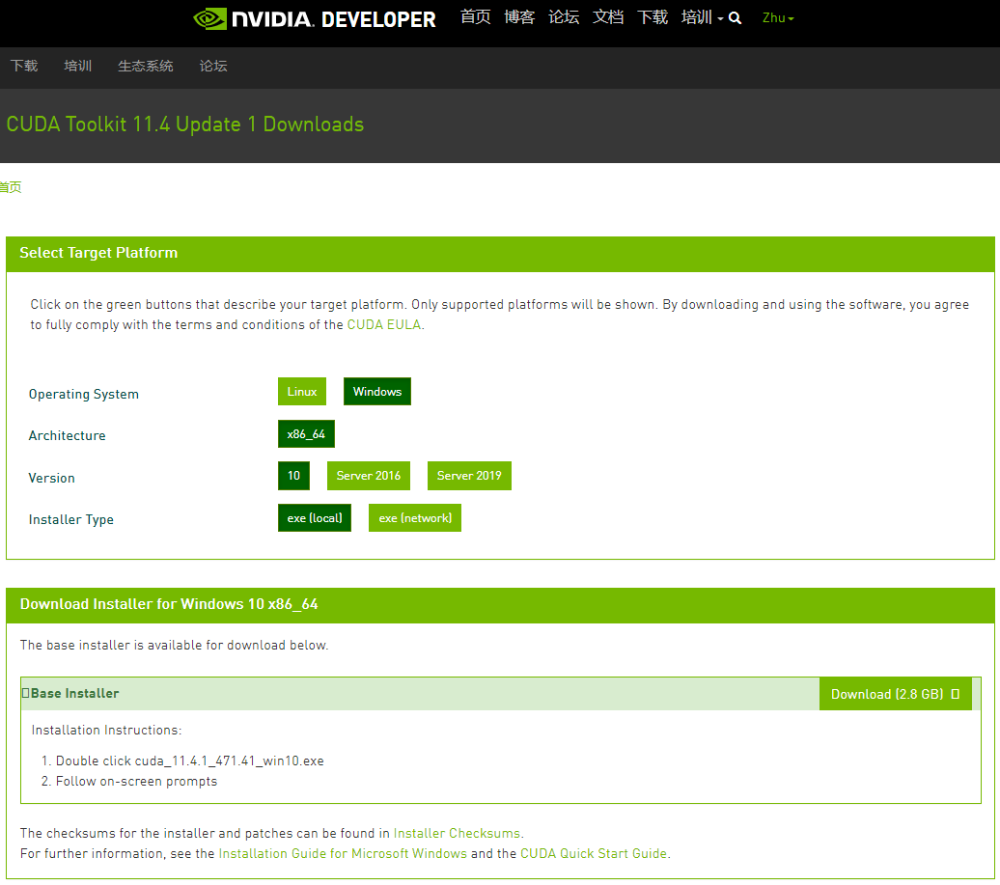

下载完成后，点击安装

将安装包解压，默认的解压目录是 `C:\User\<USER_NAME>\AppData\Local\Temp\CUDA` ，该目录可以修改成其他目录，该目录在安装完成后可以删除

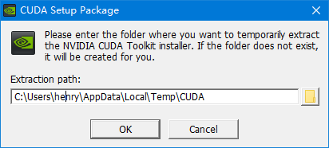

确认解压目录后，点击开始安装


安装前需要完成系统兼容性检查

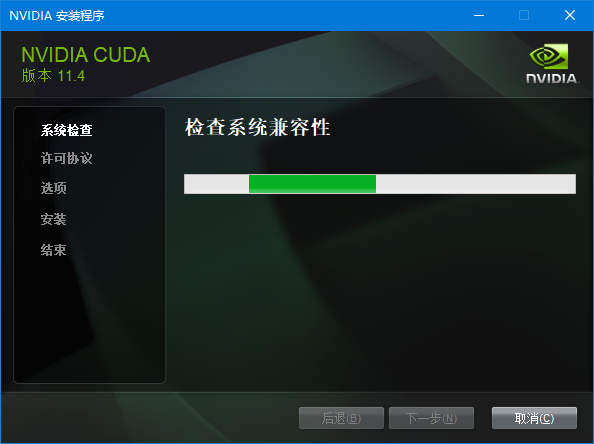

在安装选项部分，选择自定义安装，需要根据需要安装或者不安装某些组件

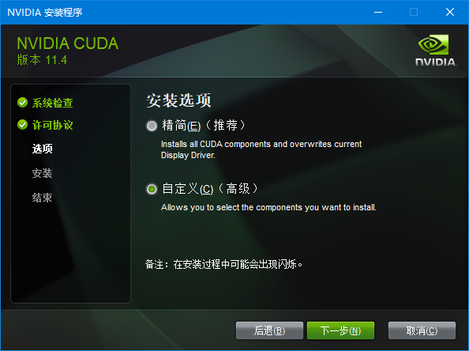

在自定义安装选项中，可以自行选择需要的组件

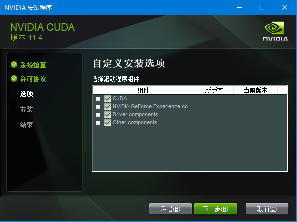

`Samples` 和 `Doucumentation` 不是必须安装的项目。

如果需要进行CUDA编程，那么 `Visual Studio` 是必须在安装CUDA之前安装完成的，同时在这一步需要选择 `Visual Studio` 和 `Nisght` 相关的组件。

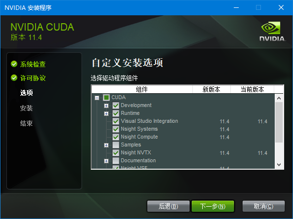

选择安装位置

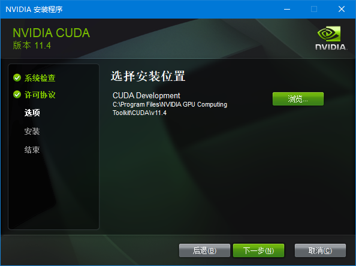

如果选择安装 Nsight 组件，那么会出现安装信息

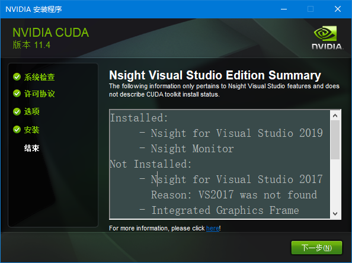

最后会显示哪些组件安装了

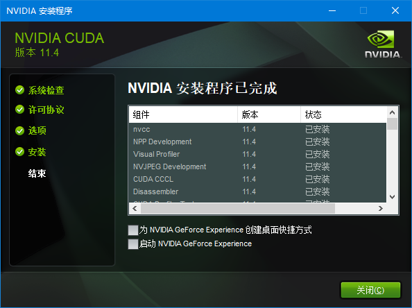


## Linux (TODO)

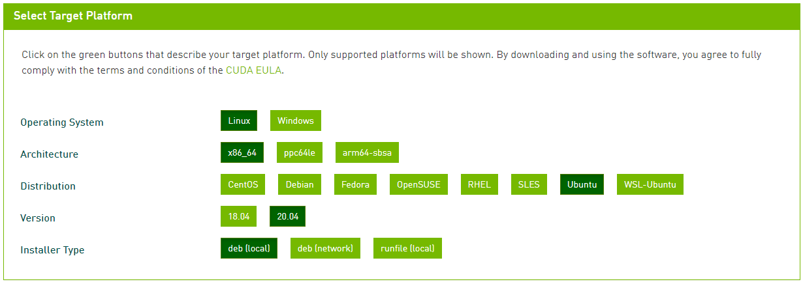


# cuDNN安装
NVIDIA CUDA® 深度神经网络库 (cuDNN) 是经 GPU 加速的[深度神经网络](https://developer.nvidia.com/deep-learning)基元库。cuDNN 可大幅优化标准例程（例如用于前向传播和反向传播的卷积层、池化层、归一化层和激活层）的实施。

世界各地的深度学习研究人员和框架开发者都依赖 cuDNN 实现高性能 GPU 加速。借助 cuDNN，研究人员和开发者可以专注于训练神经网络及开发软件应用，而不必花时间进行低层级的 GPU 性能调整。cuDNN 可加速广泛应用的深度学习框架，包括 [Keras](https://keras.io/)、[MATLAB](https://www.mathworks.com/solutions/deep-learning.html)、[PyTorch](https://pytorch.org/) 和 [TensorFlow](https://www.tensorflow.org/)。如需获取经 NVIDIA 优化且已在框架中集成 cuDNN 的深度学习框架容器，请访问 [NVIDIA GPU CLOUD](https://www.nvidia.com/en-us/gpu-cloud/) 了解详情并开始使用。


在[cuDNN](https://developer.nvidia.com/zh-cn/cudnn)页面，你可以找到[下载链接](https://developer.nvidia.com/rdp/form/cudnn-download-survey)


在下载页面勾选协议之后，可以看到安装的内容，根据你的CUDA版本来选择合适的cuDNN版本。如果没有找到你的CUDA版本，点击 `Archived cuDNN Releases` 可以查看全部版本的cuDNN

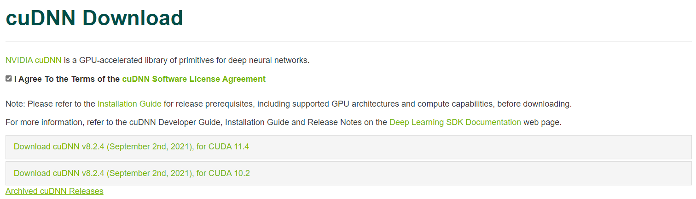

之后根据你的操作系统和硬件架构下载对应的安装包
- Windows x64 : `cuDNN Library for Windows (x64)`
- Linux x64 : `cuDNN Library for Linux (x86_64)`
  - Ubuntu 20.04 : 有三个，分别是动态库(Runtime Library)、开发库(Developer Library)、代码例程和用户说明(Code Samples and User Guide)       
    - `cuDNN Runtime Library for Ubuntu20.04 x86_64 (Deb)`
    - `cuDNN Developer Library for Ubuntu20.04 x86_64 (Deb)`
    - `cuDNN Code Samples and User Guide for Ubuntu20.04 x86_64 (Deb)`

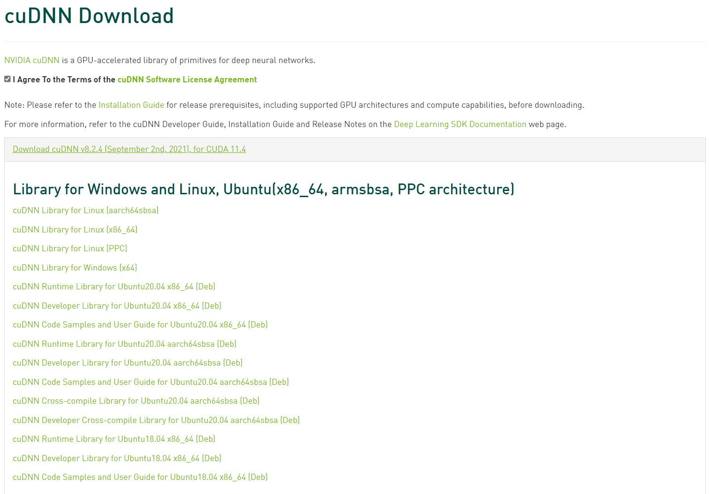

将下载的cudnn安装包解压后，在其目录下会得到如此结构的一个目录
```bash
.
└─cuda
    ├─bin
    ├─include
    ├─lib
    └─...
```
我们只需要 `cuda` 目录下的全部文件复制到 CUDA 的安装目录中即可
- Windows 默认安装目录为 : `C:\Program Files\NVIDIA GPU Computing Toolkit\CUDA\v11.4`
- Linux 默认安装目录为 : `/usr/bin/local/cuda-11.4`

CUDA的安装目录下也有着和cudnn安装目录一样的结构，只需要将其合并即可
```bash
.
├─bin
├─include
├─lib
└─...
```

> [!WARNING]
> 需要注意，cudnn的版本必须与CUDA匹配


