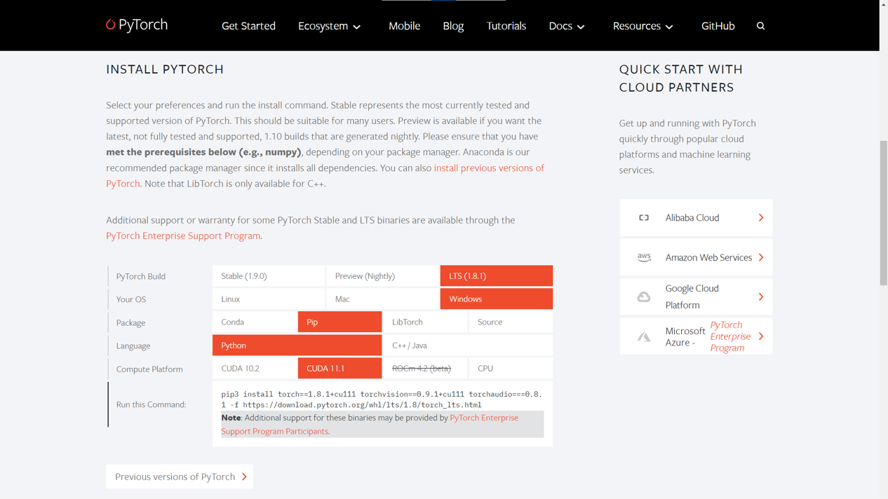

# pytorch 安装

在[pytorch官网](https://pytorch.org/)上，找到`INSTALL PYTORCH`



- `PyTorch Build` : 选择 `Stable(x.x.x)` 即可
- `Your OS` : 选择电脑操作系统
- `Package` : 安装方式，一般用pip安装
- `Language` : 选Python
- `Compute Platform`： 这里根据你电脑是否采用安装 `GPU` 版本
- `Run this Command` : 选择上述完成后，复制这里的命令行到终端运行，即可安装

> [!TIP]  
> 安装 `GPU` 版本，那么你的设备需要满足一定的要求
> - 拥有**NVIDIA的独立显卡**的设备，只需要提前安装好对应版本的 `CUDA` 和 `cudnn` 即可安装GPU版本的pytorch，安装可以[参考教程](/docs/cuda/cuda.md)
> - AMD显卡仅支持Linux系统（截至2021.10.21）
> - Mac仅支持CPU训练 (pytorch 暂时未支持 M1 Pro/Max GPU)


例如在`CUDA 11.x`环境下安装`pytorch1.8.2 LTS`的命令为
```bash
pip3 install torch==1.8.2+cu111 torchvision==0.9.2+cu111 torchaudio==0.8.2 -f https://download.pytorch.org/whl/lts/1.8/torch_lts.html
```
例如在`CUDA 11.x`环境下安装`pytorch1.9.1`的命令为
```bash
pip3 install torch==1.9.1+cu111 torchvision==0.10.1+cu111 torchaudio==0.9.1 -f https://download.pytorch.org/whl/torch_stable.html
```
耐心等待下载即可完成安装


> 安装不成功可能因为网速问题，有如下解决方案
> - 考虑科学上网
> - 在选择完需要安装的Pytorch版本后，在安装命令中附带了一个网址，那么我们就可以搜索这个网址，在里面搜索对应的版本。     
> 例如在 `CUDA 11.1` 环境下安装 `pytorch1.8.2 LTS` 的命令中，网址是 `https://download.pytorch.org/whl/lts/1.8/torch_lts.html` ，我们访问之后，查看命令中给出的 `torch` 和 `torchvision` 版本，分别是 `1.8.2+cu111` 和 `0.9.2+cu111`，我们搜索网页中全部的 `cu111` 项，就可以找到对应的链接了。点击链接下载到本地后，执行本地安装

安装完成后，在命令行启动 Python
```bash
# Linux/Mac OS
python3

# Windows
python
```

在Python的脚本环境里导入pytorch并且查看其环境
```python
Python 3.9.7 (tags/v3.9.7:1016ef3, Aug 30 2021, 20:19:38) [MSC v.1929 64 bit (AMD64)] on win32
Type "help", "copyright", "credits" or "license" for more information.
>>> import torch
>>> print(torch.__version__)
1.9.1+cu111
```