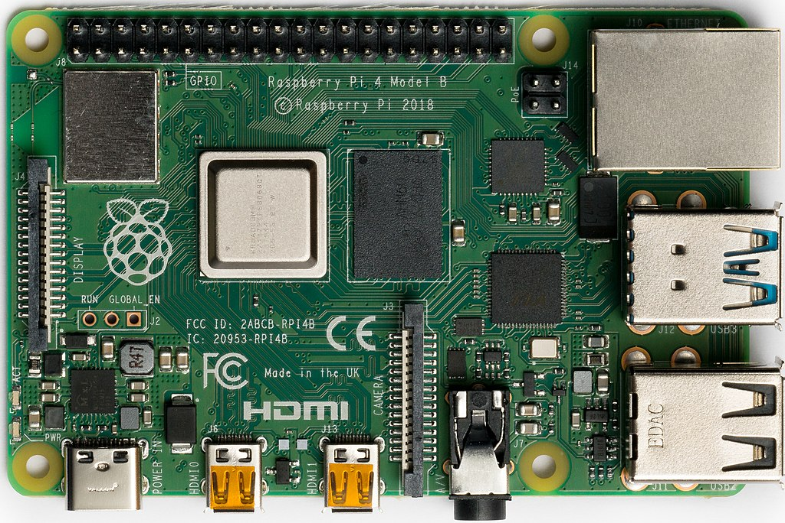

# 【树莓派】初始化树莓派
- [【树莓派】初始化树莓派](#树莓派初始化树莓派)
- [安装操作系统](#安装操作系统)
  - [下载操作系统镜像文件](#下载操作系统镜像文件)
  - [烧写操作系统](#烧写操作系统)
- [启用 SSH](#启用-ssh)
- [Wi-Fi](#wi-fi)
- [更换软件源](#更换软件源)
- [英文网页](#英文网页)
- [树莓派监控](#树莓派监控)



# 安装操作系统
## 下载操作系统镜像文件
可以简单地官方推荐的用 [Raspberry Pi Imager](https://www.raspberrypi.com/software/) 进行安装。也可以到 [操作系统镜像 Operating system images](https://www.raspberrypi.com/software/operating-systems/) 里找到需要的操作系统

树莓派4B可以下载 ARM-64bit 的 [raspios_arm64](https://downloads.raspberrypi.org/raspios_arm64/images/)

## 烧写操作系统
使用 [Etcher](https://www.balena.io/etcher/) 将镜像文件写入 micro SD card


# 启用 SSH
将系统写入 micro SD 后，在 `boot` 目录内新建 `ssh` 空文件，以启用SSH

# Wi-Fi
`wpa_supplicant.conf`
```bash
country=CN
ctrl_interface=DIR=/var/run/wpa_supplicant GROUP=netdev
update_config=1
 
network={
  ssid="WiFi-A"
  psk="12345678"
  key_mgmt=WPA-PSK
  priority=1
}
```
# 更换软件源

所有的源可以在 [Raspbian Mirrors](https://www.raspbian.org/RaspbianMirrors) 查到

[Raspbian | 镜像站使用帮助 | 清华大学开源软件镜像站 | Tsinghua Open Source Mirror](https://mirrors.tuna.tsinghua.edu.cn/help/raspbian/)

编辑 `/etc/apt/sources.list` 文件
```bash
sudo cp /etc/apt/sources.list /etc/apt/sources.list.bak
sudo vi /etc/apt/sources.list
```

替换为以下内容
```bash
deb http://mirrors.tuna.tsinghua.edu.cn/raspbian/raspbian/ buster main non-free contrib rpi
deb-src http://mirrors.tuna.tsinghua.edu.cn/raspbian/raspbian/ buster main non-free contrib rpi
```

编辑 `/etc/apt/sources.list.d/raspi.list` 文件
```bash
sudo cp /etc/apt/sources.list.d/raspi.list /etc/apt/sources.list.d/raspi.list.bak
sudo vi /etc/apt/sources.list.d/raspi.list
```
替换为以下内容
```bash
deb http://mirrors.tuna.tsinghua.edu.cn/raspberrypi/ buster main ui
```

更新源列表，并且顺便更新软件
```bash
sudo apt update
sudo apt upgrade -y
```

`sudo apt update` 可能会出现报错
```bash
Get:1 http://mirrors.tuna.tsinghua.edu.cn/raspbian/raspbian buster InRelease [15.0 kB]
Hit:2 http://mirrors.tuna.tsinghua.edu.cn/raspberrypi buster InRelease
Err:1 http://mirrors.tuna.tsinghua.edu.cn/raspbian/raspbian buster InRelease
  The following signatures couldn't be verified because the public key is not available: NO_PUBKEY 9165938D90FDDD2E
Reading package lists... Done
W: GPG error: http://mirrors.tuna.tsinghua.edu.cn/raspbian/raspbian buster InRelease: The following signatures couldn't be verified because the public key is not available: NO_PUBKEY 9165938D90FDDD2E
E: The repository 'http://mirrors.tuna.tsinghua.edu.cn/raspbian/raspbian buster InRelease' is not signed.
N: Updating from such a repository can't be done securely, and is therefore disabled by default.
N: See apt-secure(8) manpage for repository creation and user configuration details.
```

将上述公钥 `9165938D90FDDD2E` 添加至服务器（根据自己的公钥修改命令参数）
```
sudo apt-key adv --keyserver keyserver.ubuntu.com --recv-keys '9165938D90FDDD2E'
```
添加后输出信息
```
Executing: /tmp/apt-key-gpghome.1CpH6xM9lJ/gpg.1.sh --keyserver keyserver.ubuntu.com --recv-keys 9165938D90FDDD2E
gpg: key 9165938D90FDDD2E: public key "Mike Thompson (Raspberry Pi Debian armhf ARMv6+VFP) <mpthompson@gmail.com>" imported
gpg: Total number processed: 1
gpg:               imported: 1
```


# 英文网页

[Wiki](https://en.wikipedia.org/wiki/Raspberry_Pi) | [Wiki百科](https://zh.wikipedia.org/wiki/%E6%A0%91%E8%8E%93%E6%B4%BE)


# 树莓派监控
Pi Dashboard
Pi Dashboard 是树莓派实验室发布的一个开源的 IoT 设备监控工具，目前主要针对树莓派平台，也尽可能兼容其他类树莓派硬件产品。你只需要在树莓派上安装好 PHP 服务器环境，即可方便的部署一个 Pi 仪表盘，通过炫酷的 WebUI 来监控树莓派的状态！
项目主页：http://make.quwj.com/project/10
GitHub地址：https://github.com/spoonysonny/pi-dashboard


