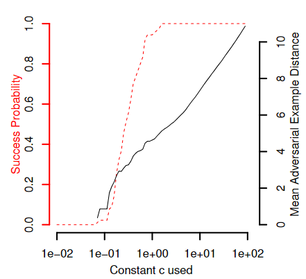
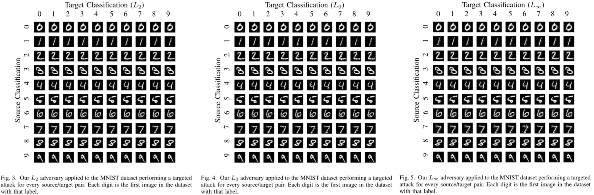
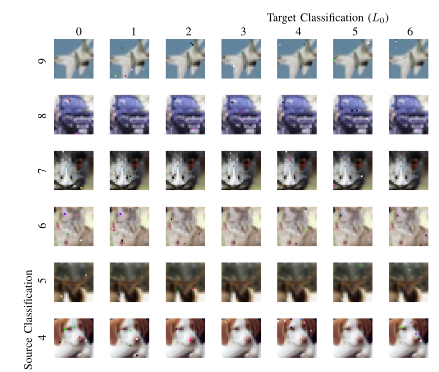
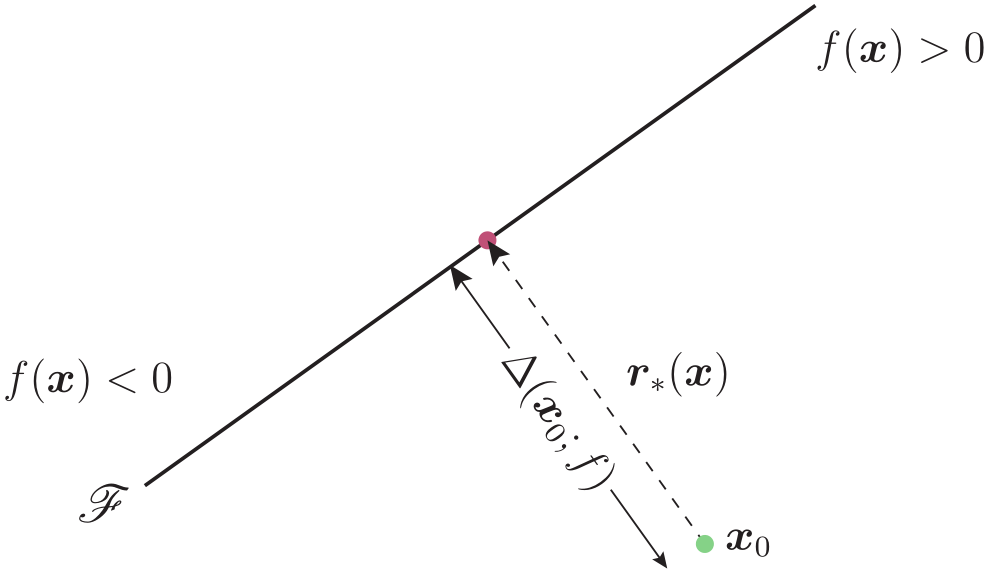
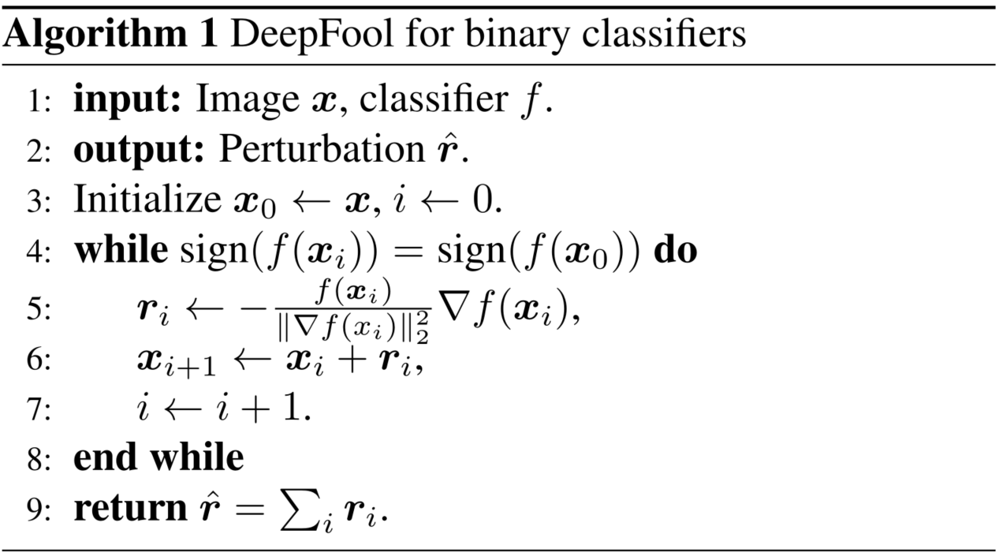
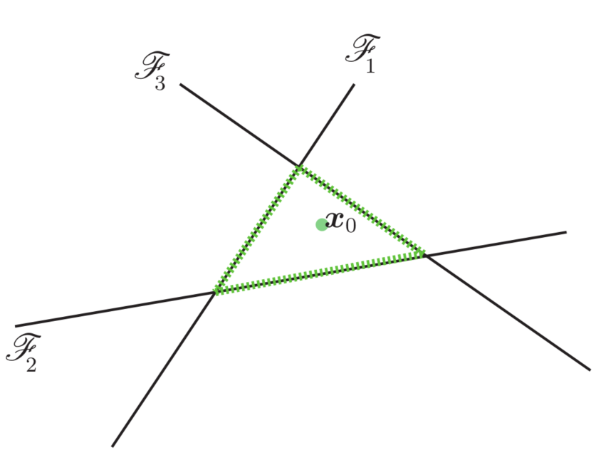
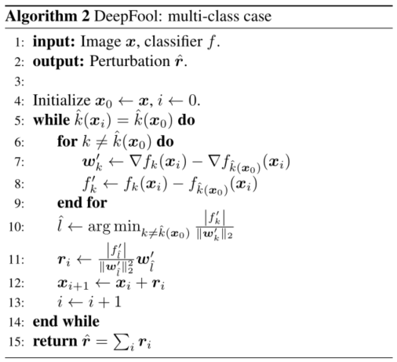

# 对抗攻击

<!-- White-box attack：白盒攻击，对模型和训练集完全了解
Black-box attack：黑盒攻击：对模型不了解，对训练集不了解或了解很少
Real-word attack：在真实世界攻击。如将对抗样本打印出来，用手机拍照识别。
targeted attack：使得图像都被错分到给定类别上。
non-target attack：事先不知道需要攻击的网络细节，也不指定预测的类别，生成对抗样本来欺骗防守方的网络。 -->

- [对抗攻击](#对抗攻击)
  - [CW (Carlini and Wagner Attacks)](#cw-carlini-and-wagner-attacks)
  - [DeepFool (CVPR 2016)](#deepfool-cvpr-2016)

## CW (Carlini and Wagner Attacks)
> [!TIP]
> - 论文标题 : [Towards Evaluating the Robustness of Neural Networks](https://arxiv.org/abs/1608.04644)
> - 论文作者 : [Nicholas Carlini](https://nicholas.carlini.com/), David Wagner (University of California, Berkeley)
> - 开源代码 : [carlini/nn_robust_attacks](https://github.com/carlini/nn_robust_attacks)
> - 背景 : 2016年提出一种[蒸馏网络的防御方法(梯度屏蔽）](https://export.arxiv.org/abs/1511.04508)，蒸馏网络的作者声称防御蒸馏能够击败现有的攻击算法，并且将他们的攻击成功率从95%降低到5%。这种防御方法通常用于任何前馈神经网络，只需要一个单独的训练步骤，就能够防御当前所存在的对抗样本。本文作者对防御性的蒸馏网络提出了挑战，设计出了一种基于优化的对抗攻击方法。

CW攻击是一种基于优化的攻击方式，其攻击思路主要有
- 添加的扰动 $\delta$ 尽量小， $x+\delta \in [0,1]^n$ 
- 对抗样本 $x+\delta$ 和干净样本 $x$ 的尽可能相似，其度量距离 $D(\cdot)$ 越小越好，即 $\text{minimize} D(x,x+\delta)$ 
- 对抗样本应该使得模型分类器 $C(\cdot)$ 产生错误的分类结果 $t$ ，即 $C(x+\delta)=t$ ，且分类错误的概率越高越好

将其表述为一个约束最小化问题：
$$\begin{aligned}
  \text{minimize}\quad    & D(x,x+\delta) \\
  \text{such that}\quad   & C(x+\delta)=t \\
                          & x+\delta \in [0,1]^n
\end{aligned}$$

但是由于$C$是高度非线性的，上述公式很难求解，因此文中定义一个目标函数$f$，使得$C(x+\delta)=t$当且仅当$f(x+\delta)\leq 0$，上面的公式就可以变成
$$\begin{aligned}
	\text{minimize}\quad    & D(x,x+\delta)+c\cdot f(x+\delta) \\
  \text{such that}\quad   & C(x+\delta)=t \\
	                        & x+\delta \in [0,1]^n
\end{aligned}$$
$c$是一个超参数，并且$c>0$。

实验发现，随着参数$c$的增大，攻击成功率（左侧红色虚线）和对抗样本平均距离（也就是对抗扰动，右侧黑色实线）也都会增大。在$c=0.1$附近的取值能够使得攻击成功率较小的情况下，扰动也较小

对于公式中的目标函数$f$
$$\begin{aligned}
  f_1(x') & = -loss_{F,t}(x')+1 \\
  f_2(x') & = [\mathop{\max}\limits_{i\neq t}(F(x')_i)-F(x')_t]^+ \\
  f_3(x') & = \text{softplus}[\mathop{\max}\limits_{i\neq t}(F(x')_i)-F(x')_t]-\log(2) \\
  f_4(x') & = (0.5-F(x')_t)^+ \\
  f_5(x') & = -\log(2F(x')_t-2)^+ \\
  f_6(x') & = [\mathop{\max}\limits_{i\neq t}(Z(x')_i)-Z(x')_t]^+ \\
  f_7(x') & = \text{softplus}[\mathop{\max}\limits_{i\neq t}(Z(x')_i)-Z(x')_t]-\log(2)
\end{aligned}$$
其中
- $(e)^+=max(e,0)$（缩写）
- $\text{softplus}=\log(1+e^x)$
- $loss_{F,t}(x)$是关于$x$的交叉熵损失
- $Z(x)$是最后一个隐藏层的输出，logit层，未经过softmax层
- $F(x)$是经过softmax的输出
- $f_1(x')$ 对目标标签的损失函数进行优化，与 L-BFGS Attack 类似
- $f_2(x')$ 对目标标签的置信度进行优化，让其成为最后的预测值
- $f_3(x')$ 对目标标签的置信度进行优化
- $f_4(x')$ 对目标标签的置信度进行优化，使其成为最大可能类
- $f_5(x')$ 对目标标签的置信度进行优化，使其成为最大可能类
- $f_6(x')$ 对目标标签的logit值进行优化，让其成为最后的预测值
- $f_7(x')$ 对目标标签的logit值进行优化，让其成为最后的预测值

此外，为了避免像素值溢出，需要对扰动$\delta_i$添加一个约束条件：$0\leq x_i+\delta_i\leq 1$，论文中称为 Box constraints

引入参数$\omega_i$，假定
$$\begin{aligned}
  -1\leq \tanh(\omega_i)\leq 1
\end{aligned}$$
那么
$$\begin{aligned}
  0\leq \frac{1}{2}(\tanh(\omega_i)+1)\leq 1
\end{aligned}$$
可以得到CW方法中对$\delta_i$的约束
$$\begin{aligned}
  x_i+\delta_i=\frac{1}{2}(\tanh(\omega_i)+1)
\end{aligned}$$
改写公式，就可以将通过优化参数$\omega_i$来限定扰动
$$\begin{aligned}
  \text{minimize}\quad    & D(x,x+\delta)+c\cdot f(\frac{1}{2}(\tanh(\omega_i)+1)) \\
  \text{such that}\quad   & C(x+\delta)=t \\
                          & x+\delta \in [0,1]^n
\end{aligned}$$

距离$D(x,x+\delta)$的计算可以选择$L_1,L_2,L_\infty$三种范数
- $L_2$ 攻击
  
	$$\begin{aligned}
    \text{minimize}\quad ||\frac{1}{2}(\tanh(\omega)+1)-x||_2^2+c\cdot f(\frac{1}{2}(\tanh(\omega_i)+1)) \\
    f(x')=\max(\max\left\{Z(x')_i:i\neq t\right\}-Z(x')_t,-\kappa),\quad set \kappa=0
  \end{aligned}$$

- $L_0$ 攻击 

  $L_0$距离度量是不可微的，因此不适合标准梯度下降。作者使用迭代算法，在每次迭代中，识别对输出结果没有太大影响的像素，并且固定其数值不做修改。

- $L_\infty$ 攻击

	$L_\infty$距离度量效果并不好，作者使用了迭代攻击来解决这个问题
  $$\begin{aligned}
      \text{minimize}\quad \sum[(\delta_i-\tau)^+]+c\cdot f(\frac{1}{2}(\tanh(\omega_i)+1))
  \end{aligned}$$
  $(\delta_i-\tau)^+=\max(\delta_i-\tau,0)$，惩罚任何超过$\tau$的扰动$\delta_i$，$0.9\leq \tau\leq 1$，$\tau$从1开始减小，小于0.9时停止

三种范数下的CW攻击(MNIST数据集)结果

CW的攻击扰动都很小，对ImageNet的攻击扰动也很小

<!-- 蒸馏防御深度神经网络中的对抗扰动 https://zhuanlan.zhihu.com/p/31177892?iam=995bd462e83ba25488ec849e8949e1f8 -->

## DeepFool (CVPR 2016)

> [!TIP]
> - 论文标题 : [DeepFool: a simple and accurate method to fool deep neural networks](https://arxiv.org/abs/1511.04599)(CVPR 2016)
> - 论文作者 : 
> - 开源代码 : [LTS4/DeepFool](https://github.com/lts4/deepfool)
> - S. Moosavi-Dezfooli, A. Fawzi, P. Frossard: DeepFool: a simple and accurate method to fool deep neural networks. In Computer Vision and Pattern Recognition (CVPR ’16), IEEE, 2016.

论文的主要贡献 : 因此，为了研究和比较不同分类器对对抗扰动的鲁棒性，需要一种精确的方法来寻找对抗扰动。它可能是更好地理解当前体系结构的局限性和设计增强健壮性的方法的关键。尽管最先进的分类器对对抗不稳定性的脆弱性很重要，但没有一个有充分根据的方法被提出来计算对抗扰动，我们在本文中填补了这一空白。
- 我们提出了一种简单而准确的方法来计算和比较不同分类器对对抗扰动的鲁棒性。
- 我们进行了广泛的实验比较，并表明1)我们的方法计算对抗性扰动比现有方法更可靠和有效2)用对抗性例子增强训练数据显著提高了对抗性扰动的鲁棒性。
- 我们表明，使用不精确的方法来计算对抗性扰动可能会导致不同的、有时是误导性的关于鲁棒性的结论。因此，我们的方法提供了一个更好的理解这一有趣的现象及其影响因素。

对抗扰动的定义 : 形式上，对于给定的分类器，对抗扰动则是足以改变预测标签$\hat{k}(x)$的最小扰动，满足
$$\begin{aligned}
  \Delta(\boldsymbol{x};\hat{k})
  :=\mathop{\min}\limits_{\boldsymbol{r}}||\boldsymbol{r}||_2  
  \text{ subject to } 
  \hat{k}(\boldsymbol{x}+\boldsymbol{r})\neq \hat{k}(\boldsymbol{x})
\end{aligned}$$
$\hat{k}(x)$是原始图像$\boldsymbol{x}$的预测标签，$\Delta(\boldsymbol{x};\hat{k})$是$\boldsymbol{x}$在$\hat{k}$上的**Robustness**，"subject to" 使……服从

- **二分类器的DeepFool**

假设分类标签 $\hat{k}(x)=sign(f(x))$ ，$f(x)$ 是一个任意标量值的图像分类函数，分类边界$\mathscr{F}\triangleq\{x:f(x)=0\}$的两边分别是正负类。

当$f$是仿射(affine)分类器 $f(x)=\omega^T x+b$ 的情况时，$f$ 在 $x_0$ 的 Robustness $\Delta(x_0;f)$ 等于从 $x_0$ 到仿射超平面 $\mathscr{F}=\{x:\omega^T x+b=0\}$ 的距离

改变分类器决策的最小扰动 $r_*(x_0)$ 对应于 $x_0$ 在分类边界 $\mathscr{F}$ 上的正交投影。它由解析公式(closed-form formula)给出：
$$\begin{aligned}
  r_*(x_0)  &:=\argmin ||r||_2 \\
            &\text{subject to } sign(f(x_0+r))\neq sign(f(x_0)) \\
            &=-\frac{f(x_0)}{||\omega||_2^2}\omega
\end{aligned}$$
> [!NOTE]
> 公式可以理解为样本 $x_0$ 到分类边界 $\mathscr{F}$ 的最短距离 $\frac{f(x_0)}{||\omega||_2}$ 与法线方向的单位向量 $\frac{\omega}{||\omega||_2}$ 的乘积，方向始终指向分类边界，所以前面有一个负号
> - 点$(x_0,y_0)$到直线$Ax+By+C=0$的距离公式为 $d=\frac{|Ax_0+By_0+C|}{\sqrt{A^2+B^2}}$

假设 $f$ 是一个通用的可微的二分类器，采用迭代程序来估计 Robustness $\Delta(x_0;f)$ ：
每次迭代中，$f$ 会在当前点 $x_i$ 周围被线性化，线性化分类器的最小扰动为
$$\begin{aligned}
  \argmin\limits_{r_i} ||r_i||_2 \text{ subject to } f(x_i)+\nabla f(x_i)^T r_i=0
\end{aligned}$$
第 $i$ 轮迭代的扰动 $r_i$ 可以用 $r_*(x_0)$ 计算得出，并且更新下一轮的 $x_{i+1}$ ，直到 $x_{i+1}$ 的符号改变为止

程序的算法如下

- **多分类器的DeepFool**

多分类器具有$c$个分类输出，分类器可以定义为$f:\mathbb{R}^n\rightarrow R^c$，分类通过下面映射完成
$$\begin{aligned}
  \hat{k}(x)=\argmax\limits_{k} f_k(x)
\end{aligned}$$
其中 $f_k(x)$ 是与第$k$个类相对应的 $f(x)$ 的输出

$f(x)$是一个仿射分类器，即对于给定的$W$和$b$ 有 $f(x)=W^Tx+b$ ，由于映射 $\hat{k}$ 是一个“一对多”分类方案的结果，欺骗分类器的最小扰动可以重写为
$$\begin{aligned}
  & \argmin\limits_{r} ||r||_2 \\
  & \text{s.t. } \exists k:\omega_k^T (x_0+r)+b_k\geq \omega_{\hat{k}(x_0)}(x_0+r)+b_{\hat{k}}(x_0)
\end{aligned}$$
$\omega_k$ 是$W$的第$k$列。这个公式表明，要改变分类结果，必须保证存在一个非原始类标的分类器结果大于原始分类函数的结果

多面体 $P$ 定义了输出标签$\hat{k}(x_0)$的空间区域，$x_0$ 在凸多面体 $P$ 内部
$$\begin{aligned}
  P=\bigcap_{k=1}^c \{x:f_{\hat{k}(x_0)}(x)\geq f_k(x)\}
\end{aligned}$$

几何上，上述的问题就是计算 $x_0$ 与凸多面体 $P$ 的距离 $\textbf{dist}(x_0,P^c)$

作者用图来说明这个问题

例如属于第四类的样本$x_0$，有$\mathscr{F}_k=\{x:f_k(x)-f_4(x)=0\}$，即$x_0$不在$\mathscr{F}_1,\mathscr{F}_2,\mathscr{F}_3$任意一个超平面上。超平面用实线表示，边界$P$用绿线表示

定义$\hat{l}(x_0)$是距离边界$P$最近的超平面，图中为$\hat{l}(x_0)=3$，$\hat{l}(x_0)$可以计算为
$$\begin{aligned}
  \hat{l}(x_0)=\argmin\limits_{k\neq \hat{k}(x_0)}\frac{f_k(x_0)-f_{\hat{k}(x_0)}(x_0)}{||\omega_k-\omega_{\hat{k}(x_0)}||_2}
\end{aligned}$$

最小扰动距离为
$$\begin{aligned}
  r_*(x_0)=
  \frac{|f_{\hat{l}(x_0)}(x_0)-f_{\hat{k}(x_0)}(x_0)|}
  {||\omega_{\hat{l}(x_0)}-\omega_{\hat{\hat{k}(x_0)}}||_2^2}  
  (\omega_{\hat{l}(x_0)}-\omega_{\hat{k}(x_0)})
\end{aligned}$$

也就是说，我们找到了$x_0$在$P$上的最近投影。并且迭代算法也变成
$$\begin{aligned}
  P=\bigcap_{k=1}^c 
  \{& x:f_{_k}(x_i)-f_{\hat{k}(x_0)}(x_i) \\
    & +\nabla f_k(x_i)^Tx-\nabla f_{\hat{k}(x_0)}(x_i)^Tx\leq 0
  \}
\end{aligned}$$

程序的算法如下
