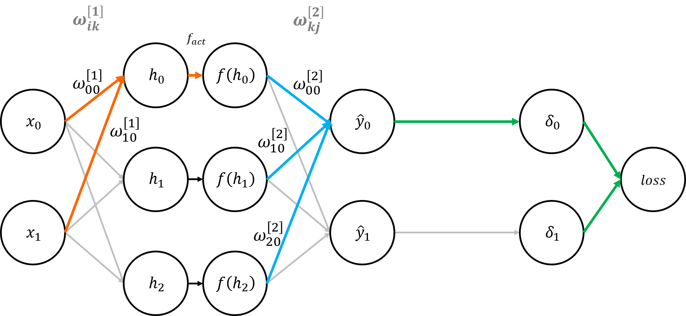
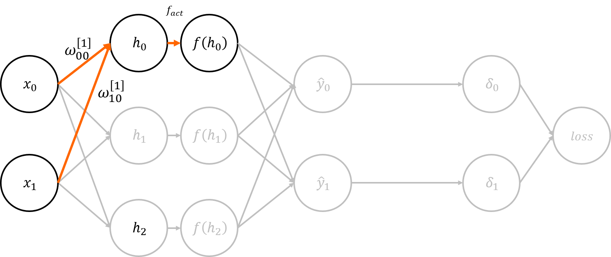
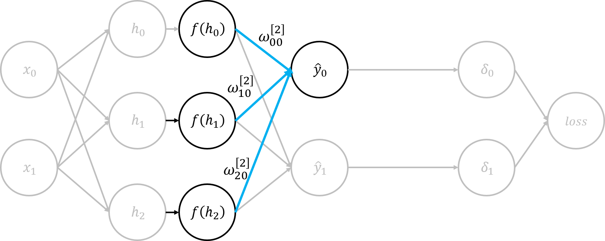
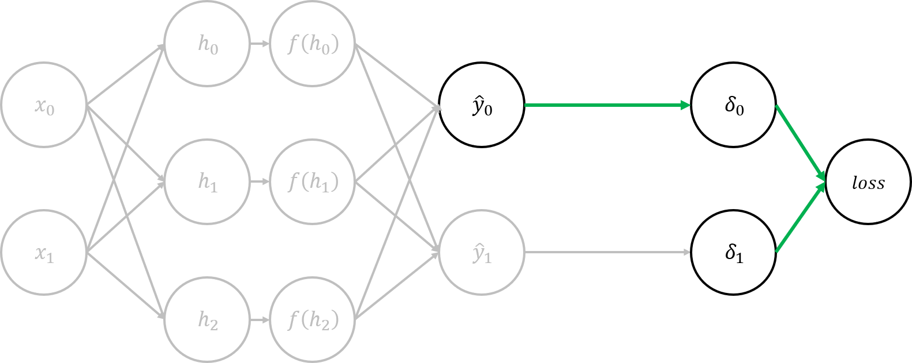
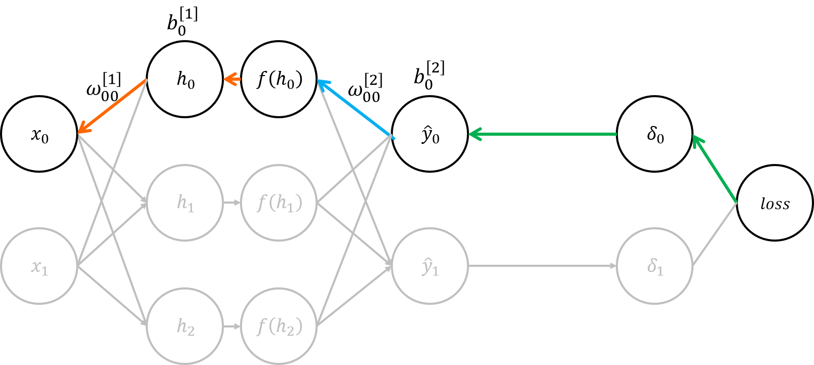
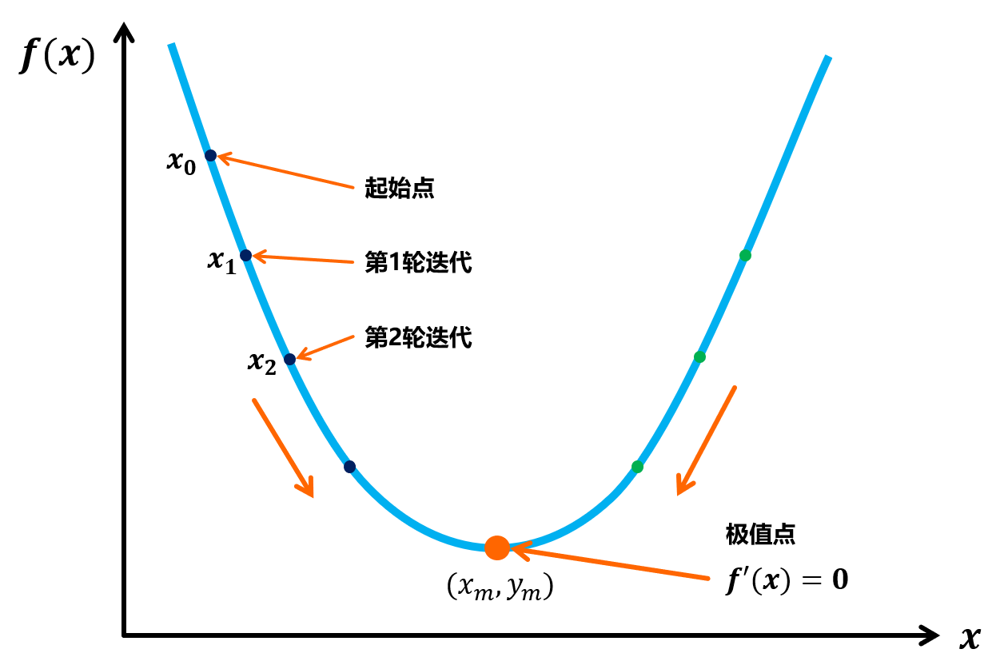
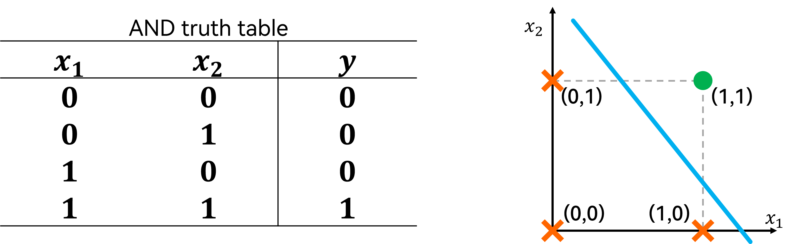
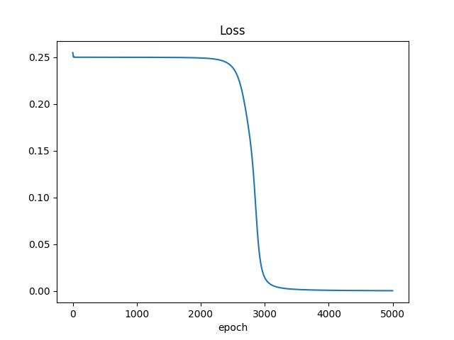
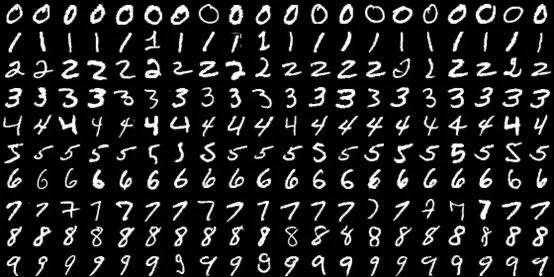

# 深度学习入门

主要分成几个部分：
- [深度学习入门](#深度学习入门)
- [😃MLP的数学原理](#mlp的数学原理)
  - [从神经元开始](#从神经元开始)
  - [多层感知器 MLP](#多层感知器-mlp)
  - [多层感知机的反向传播算法](#多层感知机的反向传播算法)
    - [网络的前向传播过程](#网络的前向传播过程)
    - [网络误差与损失函数](#网络误差与损失函数)
    - [网络的反向传播过程](#网络的反向传播过程)
- [😏MLP的基本应用](#mlp的基本应用)
  - [拟合线性模型](#拟合线性模型)
  - [拟合非线性模型](#拟合非线性模型)
  - [手写数字识别](#手写数字识别)
  - [MLP训练可视化](#mlp训练可视化)

<!-- # 😊深度学习的早期发展 -->

# 😃MLP的数学原理

## 从神经元开始
在生物学中，神经细胞具有“感受刺激”和“传导兴奋”的功能。而在人工神经网络(Artificial Neural Network, ANN)中，科研人员试图构建一个数学模型来模拟神经元的“感受刺激”和“传导兴奋”功能，这就是感知器(Perception)，也叫神经元(cell)，感知器是神经网络的组成单元


基本神经元模型中，神经元接收到来自前一层的 $n$ 个神经元传递过来的输入信号，这些输入信号通过带权重的连接(connection)进行传递，神经元接收到的总输入值将与神经元的阈值进行比较，然后通过激活函数（activation function）处理以产生神经元的输出。

包括了如下组成部分：
- 输入权重，包括权重项 $\omega_i$ 和偏置项 $\theta$ 。
- 激活函数 $f$ 。
- 输出权重y。

神经元的工作过程如下： $x_i$ 是来自第 $i$ 个神经元的输入，每个神经元会接收到 $n$ 个神经元的输入。每个输入值会占据一定的权重 $\omega_i x_i$ 所有输入( $n$ 个输入)加权后进行累加
$$
\begin{aligned}
    \sum_{i=1}^{n}\omega_i x_i=\omega_1 x_1+ \omega_2 x_2+ ...+ \omega_n x_n
\end{aligned}
$$

当该累加值超过一定的阈值 $\theta$ 之后，该神经元就会被“激活”
$$
\begin{aligned}
  f(\sum_{i=1}^{n}\omega_i x_i-\theta)
\end{aligned}
$$

该神经元“激活”之后，就会向其他神经元发送信息，这个信息就是该神经元的输出 $y$
$$
\begin{aligned}
  y=f(\sum_{i=1}^{n}\omega_i x_i-\theta)
\end{aligned}
$$

在前面部分中，我们提到了：当该累加值超过一定的阈值 $\theta$ 之后，该神经元就会被“激活”。但是我们没有明确解释什么是“激活”，下面我们通过一个例子来说“激活”一词。

其中 $\sum_{i=1}^{n}\omega_i x_i$ 是前一层神经元的输入总和，这一项我们可以理解为该神经元对前一层的神经元“感受刺激”的部分。当神经元感受到的刺激足够大的时候，就会促使该神经元向下一个神经元“传导兴奋”，也就是产生了输出 $y$。这就是“激活”的过程。

这个足够大，我们就用 $\theta$ 来衡量，当 $\sum_{i=1}^{n}\omega_i x_i > \theta$ 或 $\sum_{i=1}^{n}\omega_i x_i - \theta > 0$ 的时候，会向下传递信息，那么就可以得到一个分段表达式，我们可以用表示这个分段表达式。

$$\begin{aligned}
  \left\{
    \begin{aligned}
      & \sum_{i=1}^{n}\omega_i x_i > \theta \quad or \quad \sum_{i=1}^{n}\omega_i x_i -\theta > 0, \qquad y=E \\
      & \sum_{i=1}^{n}\omega_i x_i \leq \theta \quad or \quad \sum_{i=1}^{n}\omega_i x_i -\theta \leq 0, \qquad y=0
    \end{aligned}
  \right.
\end{aligned}$$

如果你学过《电路分析》《信号与系统》之类课程，可以知道这是一个阶跃函数，并且当 $E=1$ 的时候是一个单位阶跃函数。
$$\begin{aligned}
  u(x)=
  \left\{
    \begin{aligned}
      & 1, \qquad x>0 \\
      & 0, \qquad x\leq 0
    \end{aligned}
  \right.
\end{aligned}$$

现在，我们可以利用阶跃函数来表达神经元的“激活”。当神经元接收到上一层神经元是输入总和 $\sum_{i=1}^{n}\omega_i x_i$ 大于阈值 $\theta$ 的时候，则产生输出 $y=1$ ，否则没有输出，即 $y=0$ 。

$$\begin{aligned}
  u(x)=u(\sum_{i=1}^{n}\omega_i x_i -\theta)
  \left\{
    \begin{aligned}
      & 1, \qquad \sum_{i=1}^{n}\omega_i x_i > \theta \\
      & 0, \qquad \sum_{i=1}^{n}\omega_i x_i \leq \theta
    \end{aligned}
  \right.
\end{aligned}$$

但是，阶跃函数 $u(x)$ 不连续且不光滑，其导数仅在0点处的地方非零，是冲激函数 $\delta(x)$ ，在训练的时候，微小的变化所引起的输出就因为这个性质而消失，非常难训练


## 多层感知器 MLP


**多层感知机** (Multi-Layer Perception,MLP) ，包括了输入层、（至少一个）隐藏层、输出层，并且各个层之间通过各个参数（权重 $weight$ 和偏置 $bias$ ）连接。理论上，两层神经网络可以拟合任意函数。


::: tip 多层感知机的别名
- 深度前馈网络(Deep Feedforward Network,DFN)
- 前馈神经网络(Feedforward Neural Network,FNN)
- 由于采用反向传播(Back Propagation)算法进行训练，也会叫**BP神经网络**
- 由于多层感知机是每个神经元都与前后的全部神经元有着连接的，所以也会叫**全连接神经网络**

下面的描述中，我们将**多层感知机**都简称为**神经网络**。
:::

**MLP有什么用呢？可以用一个例子来说明**

我们假定有一个线性问题 $Y=WX+b$ 需要求解，其中权重项 $W$ 和偏置项 $b$ 是需要求解的待定系数。我们不妨先搭建一个两层神经网络如下


上面的神经网络中，有2个结点的输入层 $X$ 、4个结点的输出层 $Y$ 和一个有20个结点的隐藏层 $H$ ，其中隐藏层矩阵 $H_{(1,20)}$ 和输出层矩阵 $Y_{(1,4)}$ 分别为
$$
\begin{aligned}
  H_{(1,20)} & = X_{(1,2)} W_{1 (2,20)}+ b_{1 (1,20)} \\
  Y_{(1,4)}  & = H_{(1,20)} W_{2 (20,4)}+ b_{2 (1,4)}
\end{aligned}
$$
::: tip
- 括号内写的是矩阵的维度，$Y_{(1,4)}$ 表述输出 $Y$ 是一个 $1\times 4$ 的矩阵
- $W_1$ 是输入层和隐藏层之间的连接参数，$W_2$ 隐藏层和输出层之间的连接参数
:::

上面的方程是线性方程，将其联立可以得到输入和输出直接的关系
$$
\begin{aligned}
  Y_{(1,4)} &= X_{(1,2)}  [W_{1 (2,20)} W_{2 (20,4)}] + [b_{1 (1,20)} W_{2 (20,4)} + b_{2 (1,4)}] \\
            &= X_{(1,2)}  W_{new} + b_{new} \\
\end{aligned}
$$

我们也利用了线性方程的线性可加性，来得到上述输出 $Y$ 与输入 $X$ 之间的关系。
这不就是我们需要求解的线性问题 $Y=WX+b$ 吗。


我们将上述计算过程用矩阵的形式表示一次（矩阵对于神经网络的表示是十分重要的，尤其在编写代码的时候是十分方便的）

输入和输出都是列向量
$$
\begin{aligned}
  \vec{x} =
  \begin{bmatrix}
    x_1,x_2
  \end{bmatrix}^\mathrm{T}
  \quad
  \vec{y} =
  \begin{bmatrix}
    y_1,y_2,y_3,y_4
  \end{bmatrix}^\mathrm{T}
\end{aligned}
$$


对于隐藏层的每一个结点，都有一个权重的行向量
$$
\begin{aligned}
  \vec{w}_{1(1)} = 
  \begin{bmatrix}
    w_{1_{11}} & w_{1_{12}}
  \end{bmatrix} 
  ,...,
  \vec{w}_{1(20)} =
  \begin{bmatrix}
    w_{1_{20,1}} & w_{1_{20,2}}
  \end{bmatrix} 
\end{aligned}
$$

$$
\begin{aligned}
  \vec{W}_1 
  = \begin{bmatrix}
      \vec{w}_{1(1)} \\ \vec{w}_{1(2)} \\ ... \\ \vec{w}_{1(20)}
    \end{bmatrix}
  = \begin{bmatrix}
       w_{1_{11}} & w_{1_{12}} \\
       w_{1_{21}} & w_{1_{22}} \\
       ... \\
       w_{1_{20,1}} & w_{1_{20,2}} \\
    \end{bmatrix}
\end{aligned}
$$


第二层网络的矩阵 $\vec{W}_2$ 与上述推理一致

综上，有
$$\begin{aligned}
  \vec{h} &= \vec{W}_1 \cdot \vec{x}+\vec{b}_1 \\
  \vec{y} &= \vec{W}_2 \cdot \vec{h}+\vec{b}_2 
          =\vec{W}_2 \cdot (\vec{W}_1 \cdot \vec{x}+\vec{b}_1)+\vec{b}_2 \\
          &=(\vec{W}_2 \vec{W}_1) \cdot \vec{x}+(\vec{W_2}\cdot\vec{b}_1+\vec{b}_2)
\end{aligned}$$


通过上述线性方程的计算，我们就能得到最终的输出 $\vec{y}$ 了，线性代数告诉我们：**一系列线性方程的运算最终都可以用一个线性方程表示**。也就是说，上述两个式子联立后可以用一个线性方程表达。   

对于两层神经网络是这样，$n$ 层网络也是这样，我们可以写出 $n$ 层网络的输出表达式：
$$\begin{aligned}
  \vec{y} &=(\vec{W}_2 \vec{W}_1 ...\vec{W}_n) \cdot \vec{x}
          +(\prod_{i=2}^n W_i\vec{b}_1+\prod_{i=3}^n W_i\vec{b}_2+...+\vec{b}_n) \\
          &=(\prod_{j=1}^n{\vec{W}_j}) \cdot \vec{x}+ \sum_{j=1}^n (\prod_{i=j+1}^n W_i \vec{b}_j)
\end{aligned}$$

可以看出，虽然网络层数增加了，但是实际上的表达式没有发生如何变化，对于神经网络来说，其表达能力与单层网络式一样的，这样的线性可叠加性就使得增加神经网络层数的操作失去了意义。

为了解决这个问题，我们需要增加 **激活层** 来提高模型的非线性特性，使得模型能够更丰富的表达能力。


激活层的存在增加了模型的非线性特性，如果对上述的公式进行改写，可以得到：
$$\begin{aligned}
  \vec{h} &= f_1(\vec{W}_1 \cdot \vec{x}+\vec{b}_1) \\
  \vec{y} &= \vec{W}_2 \cdot \vec{h}+\vec{b}_2 =\vec{W}_2 \cdot f_1(\vec{W}_1 \cdot \vec{x}+\vec{b}_1)+\vec{b}_2
\end{aligned}$$

这时候，输出 $\vec{y}$ 取决于激活函数 $f_1$ 的形式，而不会是线性叠加的关系。


## 多层感知机的反向传播算法
### 网络的前向传播过程
网络前向传播的过程也叫**推理** (inference)

这里我们做最简单的网络模型



其中
- 输入层有 $n$ 个神经元结点 $x_i,\quad i=0,1,...,n$
- 隐藏层有 $t$ 个神经元结点 $h_k,\quad k=0,1,...,t$
- 输出层有 $m$ 个神经元结点 $\hat{y_j},\quad j=0,1,...,m$




第一层网络的传播过程可以总结为以下公式
$$\begin{aligned}
  h_k=\sum_{i=0}^{n-1} \omega_{ik}^{[1]} x_i + + b_0^{[1]}
\end{aligned}$$

算上激活之后就是这一层网络的最终输出
$$\begin{aligned}
  f(h_k)=f_{act}(\sum_{i=0}^{n-1} \omega_{ik}^{[1]} x_i + b_0^{[1]})
\end{aligned}$$
> [!NOTE]
> - $f_{act}(x)$是激活函数(activation)    
> - 其中，有$n$个输入$(x_i, i=0,...,n-1)$。这里是为了迎合计算机编程数组下标从$0$开始的习惯
> - 这里神经元应该只画一个就好，但是为了便于理解和后面反向传播的过程，这里画两个圆

下面两个参数都是训练神经网络的时候**最重要的参数**，也是需要训练的参数，神经网络的训练也就是为了调整下面两个参数，使得网络的推理性能达到最佳。
- 参数 $\omega_{ik}^{[l]}$。在第 $l$ 层网络中，第 $i$ 个输入和第 $k$ 个隐藏层神经元连接的权重。
- 参数 $b_k^{[l]}$ (bias)。第$l$层网络、第$k$个结点的偏置项。


那么对于隐藏层的第一个结点$f(h_0)$

$$\begin{aligned}
  h_0  =\sum_{i=0}^{1} \omega_{i0}^{[1]} x_i + b_0^{[1]}
        =\omega_{00}^{[1]} x_i + \omega_{10}^{[1]} x_i + b_0^{[1]}
\end{aligned}$$

::: tip
这里的激活函数选择哪一个函数对对最后得出的结论没有影响，并且会使得推理过程比较一样混乱，暂不实例化该函数，即在推导过程中。
:::

如果选择 Sigmoid 函数作为激活函数，那么输出如下：

$$\begin{aligned}
  f(h_0)  &= f_{act}(\sum_{i=0}^{1} \omega_{i0}^{[1]} x_i + b_0^{[1]})  
          = f_{act}(\omega_{00}^{[1]} x_i + \omega_{10}^{[1]} x_i + b_0^{[1]}) \\
          &= \frac{1}{1+e^{-(\omega_{00}^{[1]} x_i + \omega_{10}^{[1]} x_i + b_0^{[1]})}}
\end{aligned}$$



第二层网络如图，输出层网络的传播过程可以总结为以下公式
$$\begin{aligned}
  \hat{y}_j=\sum_{k=0}^{m-1} \omega_{kj}^{[2]} h_k + b_0^{[2]} \qquad k=0,...,t
\end{aligned}$$

其中，有$t$个隐藏层输入$h_k$，这里输出值$\hat{y}_j$也是预测值

对于输出层的第0个输出结点，有
$$\begin{aligned}
  \hat{y}_0=\sum_{k=0}^{m-1} \omega_{k0}^{[2]} h_k + b_0^{[2]}
\end{aligned}$$


至此，就完成了MLP 前向传播的过程（推理）。

但是会发现几个问题
1. 我们得到了网络的输出，也就是一个网络给出的预测值，我们就可以用这个预测值来判断结果了，那这个预测值和实际值是不是一致的呢？这是第一个需要解决的问题，如何保证输出结果的可靠程度。
2. 上面提到的参数 $\omega$ 和 $b$ 是随机初始化的，并没有指定参数值，这就导致网络的输出是随机甚至是错误的值。这是第二个需要解决的问题，网络参数的随机初值。

为了解决上述两个问题，我们首先引入误差函数也叫损失函数，来衡量网络的预测输出和真实值之间的差距，当损失函数越小，那么也就证明网络的预测输出和真值越相似，这个输出也就越可靠。而我们也可以通过损失函数，来调整网络随机初始化的网络参数，使得网络在新的参数下输出的预测越接近真值。


### 网络误差与损失函数
解决上述的第一个问题，我们需要定义损失函数。

常见的损失函数一般是衡量两个数值，但是当我们不只有一个输出的时候（如下图），我们如何去界定每一个输出达到最优呢？调整参数的时候也会对各个输出有影响的。比如在二输出网络中，有 $\hat{y}_0$ 和 $\hat{y}_1$ 。当我们好不容易调整好网络参数使得每次输出的 $\hat{y}_0$ 都可以达到最优（最优是指，预测值和实际值的误差尽可能小），但是 $\hat{y}_1$ 却很大了，这就破坏了网络。

因此，我们想到一个思路，就是计算每个输出的误差，然后对误差进行累加，只要总误差最小，那也就是使得各个误差**尽可能**达到最小，那么这个网络也会最优。




得到了输出的预测值$\hat{y_i}$，和我们真实值之间的误差为$|\hat{y_i}-y_i|$。
<!-- 为了消除绝对值的影响、便于计算，我们使用 **MSE（均方方差）**，这也是常用的误差函数 -->
$$\begin{aligned}
  MSE=\frac{1}{n}\sum_{i=0}^{n-1}(y_i-\hat{y}_i)^2
\end{aligned}$$

当然，根据不同的需求选择不同的损失函数，损失函数可以大致分为两类：分类损失（Classification Loss）和回归损失（Regression Loss）。

不过在这里我们还是用 $\delta_j=Loss(\hat{y}_j,y_j)$ 来表示损失函数，也是便于计算而已。


得到了 $\delta_j$ 之后，我们就可以计算总误差
$$\begin{aligned}
    loss=\sum_{j=0}^{m-1}\delta_j=\sum_{j=0}^{m-1}Loss(\hat{y}_j,y_j)
\end{aligned}$$
得到了以上的通用公式之后，我们就可以计算出最后的**总损失**了。
$$\begin{aligned}
  loss
  = \sum_{j=0}^{m-1}\delta_j=\sum_{j=0}^{1}Loss(\hat{y}_j,y_j) 
  = Loss(\hat{y}_0,y_0)+Loss(\hat{y}_1,y_1)
\end{aligned}$$

在上面的全部计算中，我们只计算了一条线，是经过$x_0$、$h_0$、$f(h_0)$、$\hat{y}_0$、$\delta_0$、$loss$，但是该网络还有其他的参数$\omega_{ik}^{[l]}$、$b_k^{[l]}$，为每一层的权重和偏置。  

$loss$ 是仅与权重 weight 和偏置 bias 有关，而与各个神经元的输出无关的函数，实际上是这样的，所以在之后对 $loss$ 求导的时候都是求偏导
$$\begin{aligned}
    loss = loss(\omega_{00}^{[1]},\omega_{01}^{[1]},...,\omega_{ik}^{[l]};b_0^{[1]},b_1^{[1]},...b_k^{[l]})
\end{aligned}$$

### 网络的反向传播过程



我们反向传播的目的是\textbf{通过损失函数去调整网络参数，从而使得此后的推理过程中，求得的损失函数最小，这时候得到的输出是最好的。}




如图，我们需要找到损失函数的极小值，即 $f'(x)$ 对应的极值点 $(x_m,y_m)$ 。

我们每次迭代需要完成的任务就是向极小值方向逼近。

> [!NOTE]
> 梯度$\nabla f(x)$ 是一个**向量**，方向是函数上升最快的方向，那么如果加上一个负号$-\nabla f(x)$，就可以指向函数下降最快的方向了。这时候我们就确定了逼近的方向。


从起始点$x_0$开始，我们每次逼近都是需要移动一定的步长$lr$。这时候我们就确定了每次逼近修改的数值。

上面的分析就可以得到深度学习中最重要的公式：**梯度下降**公式
$$\begin{aligned}
  param_{new}=param-lr \times \frac{\partial loss}{\partial param}
\end{aligned}$$

- $lr$ 在神经网络中称为**学习率**，也就是每次逼近的步长。
- $param$ 是需要修正的参数

> [!NOTE]
> 学习率是神经网络训练中一个重要的超参数


那我们开始以修正$\omega_{00}^{[2]}$为例开始我们的公式推导，利用学过的\textbf{链式求导法则}。
$$\begin{aligned}
    \frac{\partial loss}{\partial \omega_{00}^{[2]}}=
    \frac{\partial loss}{\partial \delta_0} \times 
    \frac{\partial \delta_0}{\partial \hat{y}_0} \times 
    \frac{\partial \hat{y}_0}{\partial \omega_{00}^{[2]}}
\end{aligned}$$

公式中三个乘积项分别为
$$\begin{aligned}
  loss=\sum_{j=0}^{m-1}\delta_j=\delta_0+\delta_1 
  \qquad & \therefore
  \frac{\partial loss}{\partial \delta_0}=1 
  \\
  \delta_0=Loss(\hat{y}_0,y_0)
  \qquad & \therefore
  \frac{\partial Loss(\hat{y}_0,y_0)}{\partial \hat{y}_0} 
  \\
  \hat{y}_0=\sum_{k=0}^{m-1} \omega_{k0}^{[2]} h_k + b_0^{[2]}
  \qquad & \therefore
  \frac{\partial \hat{y}_0}{\partial \omega_{00}^{[2]}}=h_0
\end{aligned}$$

综上，代入公式可以得到最后的算式
$$\begin{aligned}
  \frac{\partial loss}{\partial \omega_{00}^{[2]}}=
  1 \times \frac{\partial Loss(\hat{y}_0,y_0)}{\partial \hat{y}_0}\times h_0
\end{aligned}$$

如果选损失函数为**均方误差**
$$\begin{aligned}
  MSE =\frac{1}{2}\sum_{i=0}^{1}(y_i-\hat{y}_i)^2
      = (y_0-\hat{y}_0)^2+(y_1-\hat{y}_1)^2
\end{aligned}$$

那么可以进一步
$$\begin{aligned}
  \frac{\partial loss}{\partial \omega_{00}^{[2]}}
  & = 1 \times \frac{\partial Loss(\hat{y}_0,y_0)}{\partial \hat{y}_0}\times h_0
  = 1 \times \frac{\partial MSE(\hat{y}_0,y_0)}{\partial \hat{y}_0}\times h_0 \\
  & = 1 \times 2 (\hat{y}_0-y_0) \times h_0 
  = 2 (\hat{y}_0-y_0) h_0
\end{aligned}$$


上面的计算可以看出，其实损失函数选择哪一个对公式的推导是没有影响的，为了简化推导流程，我们在上面都不会计算具体的损失函数，激活函数也是如此的，因此推导过程都没有实例化激活函数和损失函数。

那么修正后的新的参数
$$\begin{aligned}
  {\omega_{00}^{[2]}}_{new}
  =\omega_{00}^{[2]}-lr \times \frac{\partial loss}{\partial \omega_{00}^{[2]}}
  =\omega_{00}^{[2]}-lr \times 2 (\hat{y}_0-y_0) h_0
\end{aligned}$$

下一次推理就用这个参数进行推理，得到的损失函数（理论上）就会更小

::: tip 这里为什么说是极小值点，而不是最小值点呢？    
因为在 $MSE$ 中极小值点就是最小值点，但是有其他的一些损失函数不一定只有一个极小值点，这里只是比较严谨一点。也可以看出，为了方便寻找损失函数的最小值，一般选择的损失函数只存在一个极小值点。这也是好的损失函数必须具备的。在自定义损失函数的时候就必须考虑到这一点。
:::


# 😏MLP的基本应用

## 拟合线性模型

数字逻辑运算（布尔代数）中，逻辑与 (AND) 是一种很典型的线性计算
$$Y=X_1+X_2$$
AND的真值表如下，AND是线性可分的，即能够在二维空间上找到一个超平面(hyperplane)将两组数据分开


同时
$$\begin{aligned}
  Ax=y
\end{aligned}$$

$$\begin{aligned}
  A
  \begin{bmatrix}
    0 & 0 \\
    0 & 1 \\
    1 & 0 \\
    1 & 1 
  \end{bmatrix}
  =\begin{bmatrix}
    0 \\ 0 \\ 0 \\ 1
  \end{bmatrix}
\end{aligned}$$


我们将AND的全部输入$X_1,X_2$和输出$Y$作为一组数据集
```python
AND_DATA = ( # (x1,x2,y)
    (0, 0, 0), 
    (0, 1, 0), 
    (1, 0, 0), 
    (1, 1, 1))
```

为了能够使用 pytorch 进行训练，需要处理成 pytorch 能够接受的 [Tensor](https://pytorch.org/docs/stable/tensors.html) 数据格式

```python
# numpy分割输入和输出
import numpy as np
data = np.array(AND_DATA, dtype='float32')
x = data[:, 0:2]
y = data[:, 2]

# 转换成Tensor
import torch
x_tensor = torch.Tensor(x)
y_tensor = torch.Tensor(y)
# 可以取消注释，观察数据集的输入x、输出y
# print(x)
# print(y)  

x_tensor=x_tensor.reshape(-1,2)
y_tensor=y_tensor.reshape(-1,1)
```

::: tip 什么是Tensor
[Tensor(张量)](https://zhuanlan.zhihu.com/p/48982978)？
:::

对于AND，我们可以用一个神经元模型来拟合这个模型


AND的神经元数学模型为
<!-- \tag{1.1} -->
$$\begin{aligned}
  y=f(\sum_{i=1}^{2}\omega_i x_i+\theta)=f(\omega_1 x_1+\omega_2 x_2+\theta)
\end{aligned}$$

在pytorch中，我们可以使用[`torch.nn.Linear`](https://pytorch.org/docs/stable/generated/torch.nn.Linear.html#torch.nn.Linear)来表示AND的神经元数学模型
```python
torch.nn.Linear(in_features=2,out_features=1,bias=True)
```

其中$f$为感知器的激活函数，这里我们使用`Sigmoid`函数进行激活
$$\begin{aligned}
  f(x)=Sigmoid(x)=\frac{1}{1+e^{-x}}
\end{aligned}$$
在pytorch中，`Sigmoid`激活函数可以表示为：
```python
f_x=torch.nn.Sigmoid()(x)
```

所以对于逻辑“与”运算
$$\begin{aligned}
  y &= Sigmoid(\omega_1 x_1+\omega_2 x_2+\theta) \\
    &= \frac{1}{1+e^{\omega_1 x_1+\omega_2 x_2+\theta}}
\end{aligned}$$
我们可以很方便地使用pytorch的API定义该感知器的计算模型，实现AND的神经元模型
```python
x=(0,1)     # x_1=0, x_2=1
y=torch.nn.Sigmoid()(torch.nn.Linear(2,1)(x))
```
但是上述的计算，将无法利用pytorch进行模型训练，因此我们需要将该模型用pytorch的[`torch.nn.Module`](https://pytorch.org/docs/stable/generated/torch.nn.Module.html#torch.nn.Module)模块将模型进行封装
```python
import torch
from torch import nn
class Perceptron(nn.Module):
    def __init__(self):
        super(Perceptron, self).__init__()
        self.fc = nn.Linear(in_features=2,out_features=1,bias=True)
        self.avticate = nn.Sigmoid()

    def forward(self, x:torch.Tensor):
        x = self.avticate(self.fc(x))
        return x
print(Perceptron())
```

训练之前我们需要定义两个训练参数，最大训练[轮数(epoch](https://www.jianshu.com/p/22c50ded4cf7?from=groupmessage))`MAX_EPOCH`和[学习率(learning rate)](https://zhuanlan.zhihu.com/p/56029557)`LR`，并且初始化[损失函数](https://zhuanlan.zhihu.com/p/58883095)和训练[优化器](https://zhuanlan.zhihu.com/p/85978296)，此外，我们还需要记录下损失的变化`loss_list`
```python
MAX_EPOCH = 50  # 修改最大训练轮数,观察损失函数及输出结果
LR = 0.1        # 修改学习率,观察损失函数及输出结果
model = Perceptron()
criterion = nn.MSELoss()  # define: loss function -- MSE
from torch import optim
optimizer = optim.SGD(model.parameters(), lr=LR,
                        momentum=0.9)  # define: optimizer -- SGD
loss_list = []  # 记录损失
```
开始训练感知器，并用[`tqdm`](https://tqdm.github.io/)显示进度
```python
import tqdm
pbar=tqdm.tqdm(range(MAX_EPOCH))
for epoch in pbar:  # Start Training
    out = model(x_tensor)

    loss = criterion(out, y_tensor)  # Compute Loss
    loss_list.append(loss.item())
    
    loss.backward()  # Back propagation
    optimizer.step()  # update
    optimizer.zero_grad()  # CLear Gradient Buffer
    pbar.set_description("Train Loss:%.10f"%(float(loss)))
```

打印并且查看感知器的权重
```python
for w in model.named_parameters():
    print(w)
```
感知器的权重如下所示
```python
('fc.weight', Parameter containing:
tensor([[6.5308, 6.5308]], requires_grad=True))
('fc.bias', Parameter containing:
tensor([-9.8853], requires_grad=True))
```
根据感知器模型，我们可以得出，用于模拟逻辑与运算的公式可以表达为：
$$\begin{aligned}
  y & = Sigmoid(6.5308 x_1+6.5308 x_2 - 9.8853) \\
    &= \frac{1}{1+e^{6.5308 x_1+6.5308 x_2 - 9.8853}}
\end{aligned}$$


测试模型
```python
# Test model
y_pred = model(x_tensor)
input = x_tensor.detach().numpy()
output = y_pred.detach().numpy()
print(" === Train data === ")
for i in range(len(x)):
    print("    %d and %d = %d" % (x[i][0], x[i][1], y[i]))
print(" === Train Result (Epoch:%d)=== " % MAX_EPOCH)
for i in range(len(input)):
    print("    %d and %d = %.5f" % (input[i][0], input[i][1], output[i]))
```
输出结果为
```bash
=== Train Result (Epoch:5000)===
  0 and 0 = 0.00005
  0 and 1 = 0.03376
  1 and 0 = 0.03376
  1 and 1 = 0.95992
```
> 上述的结果近似是正确的，一方面Sigmoid函数(公式1.3)的函数上界和下界是分别趋近于1和0的（[Sigmoid的函数曲线](https://bkimg.cdn.bcebos.com/pic/c9fcc3cec3fdfc03f23fbf16d73f8794a5c226dc?x-bce-process=image/resize,m_lfit,w_800,limit_1/format,f_auto)），因此在用Sigmoid函数进行激活后结果也会趋近的，另一方面，模型的训练是向结果标签（1和0）进行[收敛](https://baike.baidu.com/item/%E6%94%B6%E6%95%9B/5957628?fr=aladdin)。

打印损失函数
```python
# Plot
import matplotlib.pyplot as plt
plt.plot(loss_list)
plt.title("Loss")
plt.xlabel("epoch")
plt.show()
```


## 拟合非线性模型
逻辑异或(XOR)运算：


XOR数据集加载

所以我们可以得到如下数据作为训练集输入
```python
XOR_DATA = ((0, 0, 0), (0, 1, 1), (1, 0, 1), (1, 1, 0)) # (x1,x2,y)
```
构建一个两层的全连接网络


对于上图网络，两个输入，一个输出，包含两个隐藏层
```python
from torch import nn
class MLP(nn.Module):
  def __init__(self):
    super(MLP, self).__init__()
    self.fc1 = nn.Linear(2, 3)  # Hidden Layer : 3 neuron
    self.fc2 = nn.Linear(3, 4)  # Hidden Layer : 4 neuron
    self.fc3 = nn.Linear(4, 1)  # Output Layer : 1 neuron
    self.avticate = nn.Sigmoid()
  def forward(self, x):
    x = self.avticate(self.fc1(x))
    x = self.avticate(self.fc2(x))
    x = self.avticate(self.fc3(x))
    return x
```

训练网络完成XOR的计算

导入数据
```python
import numpy as np
data = np.array(XOR_DATA, dtype='float32')
x, y = data[:, 0:2], data[:, 2]
```
将输入输出转化为用于训练的tensor
```python
import torch
x_tensor, y_tensor = torch.Tensor(x.reshape(-1, 2)), torch.Tensor(y.reshape(-1, 1))  
```
加载模型并打印查看网络结构
```python
model = MLP()
print(model)
```
> 模型、网络在这可以理解为同一个词，不加以区分，训练网络和训练模型是同样的意思。个人理解，网络是模型的结构


加载损失函数、优化器
```python
import torch.optim as optim
MAX_EPOCH = 5000  # 修改最大训练轮数,观察损失函数及输出结果
LR = 0.1          # 修改学习率,观察损失函数及输出结果
criterion = nn.MSELoss()  # define: loss function -- MSE  
optimizer = optim.SGD(model.parameters(), lr=LR, momentum=0.9)  # define: optimizer -- SGD
loss_list = []    # 记录损失
```
训练网络，用`tqdm`显示训练进度
```python
import tqdm
pbar=tqdm.tqdm(range(MAX_EPOCH))
for epoch in pbar:  # Start Training
    out = model(x_tensor)    
    loss = criterion(out, y_tensor)  # Compute Loss
    loss_list.append(loss.item())

    loss.backward()  # Back propagation
    optimizer.step()  # update
    optimizer.zero_grad()  # CLear Gradient Buffer
    pbar.set_description("Train Loss:%.10f"%(float(loss)))
```

训练完成后，对网络进行测试，并且打印出预测的结果
```python
# Test model
y_pred = model(x_tensor)
input = x_tensor.detach().numpy()
output = y_pred.detach().numpy()
print(" === Train data === ")
for i in range(len(x)):
    print("    %d xor %d = %d" % (x[i][0], x[i][1], y[i]))
print(" === Train Result (Epoch:%d)=== " % MAX_EPOCH)
for i in range(len(input)):
    print("    %d xor %d = %.5f" % (input[i][0], input[i][1], output[i]))
```

打印出训练的损失曲线
```python
import matplotlib.pyplot as plt
plt.plot(loss_list)
plt.title("Loss")
plt.xlabel("epoch")
plt.show()
```


实验结果
```bash
Train Loss:0.0003692701: 100%|████████| 5000/5000 [00:05<00:00, 938.43it/s]
 === Train data ===
    1 xor 0 = 1
    0 xor 1 = 1
    1 xor 1 = 0
    0 xor 0 = 0
 === Train Result (Epoch:5000)=== # 训练结果，网络推理结果
    1 xor 0 = 0.98092
    0 xor 1 = 0.98150
    1 xor 1 = 0.02398
    0 xor 0 = 0.0139
```
损失函数变化曲线：




<!-- ## 鸢尾花分类 (TODO) -->
## 手写数字识别
对于手写数字识别任务，我们通常使用公开的数据集——[MNIST数据集](http://yann.lecun.com/exdb/mnist/)，由60000张训练集和10000张验证集构成，每张图像的大小为28*28



MNIST数据集已经被收录到了pytorch中的[`torchvision.datasets.MNIST`](https://pytorch.org/vision/stable/datasets.html#mnist)中
```python
import torchvision
train_set=torchvision.datasets.MNIST(
  DATASET_PATH, # 数据集存储地址
  train=True,   # 是否是训练集，训练集有6w张图像，验证集1w张
  download=True, # 下载可能会因为网络而失败，需要不断下载，直到下载完成
  transform=torchvision.transforms.Compose([  # 数据预处理
    torchvision.transforms.ToTensor()         # 转化为 Tensor
    ])
  )
```

运行下面程序，观察MNIST数据集的图像
```python
import os
DATASET_PATH = os.path.join(os.path.dirname(__file__), 'datasets')
if not os.path.exists(DATASET_PATH):
  os.makedirs(DATASET_PATH)

import torchvision
train_set=torchvision.datasets.MNIST(DATASET_PATH,train=True,download=True)

import cv2
import numpy as np
i=0
for dataSample in train_set:
    image=dataSample[0]
    label=dataSample[1]
    cv2.imshow('img',cv2.resize((cv2.cvtColor(np.asarray(image),cv2.COLOR_RGB2BGR)),dsize=(300,300)))
    cv2.waitKey(100)
    if i>=30: break 
    else: i+=1
cv2.destroyAllWindows()
```

基于MLP的手写数字识别
我们采用[多层感知器（Multilayer Perceptron,MLP）](https://zh-v2.d2l.ai/chapter_multilayer-perceptrons/index.html)，并且使用sigmoid进行激活
> MLP，由于采用反向传播算法（backward propagation 或 backpropagation，BP），因此也叫BP神经网络；同时MLP是一种由全连接的网络，也叫全连接网络

加载数据集
```python
train_set=torchvision.datasets.MNIST(DATASET_PATH,train=True,download=True)
```
```python
class MLP(nn.Module):
    def __init__(self,input_node):
        super(MLP, self).__init__()
        self.fc1 = nn.Linear(input_node, 400)  # Hidden Layer 
        self.fc2 = nn.Linear(400, 200)  # Hidden Layer 
        self.fc3 = nn.Linear(200, 100)  # Hidden Layer 
        self.fc4 = nn.Linear(100, 10)   # Output Layer 
        self.avticate = nn.Sigmoid()
    def forward(self, x):
        x = self.avticate(self.fc1(x))
        x = self.avticate(self.fc2(x))
        x = self.avticate(self.fc3(x))
        x = self.avticate(self.fc4(x))
        return x
```

构建完成MLP之后，我们先加载模型和训练模型的损失函数和优化器
```python
# 加载网络
model = MLP(784)  # 28*28=784
# 选择损失函数
criterion = nn.CrossEntropyLoss()  # define: loss function
# 配置优化器
import torch.optim as optim
optimizer = optim.Adam(model.parameters())
```

训练代码
```python
# 开始训练
import tqdm
import torch
loss_list = []
MAX_EPOCH = 5000
for epoch in range(MAX_EPOCH):  # Start Training
  run_loss=0.0
  run__acc=0

  pbar_train=tqdm.tqdm(train_set)
  for data_train in pbar_train:
      image=data_train[0]
      label=data_train[1]
      input_tensor=torch.Tensor(np.array(image))
      input_tensor=torch.reshape(input_tensor,(1,-1))
      label_tensor=torch.Tensor([label]).long()
      outputs=model(input_tensor)
      _, pred = torch.max(outputs.data, 1)
      optimizer.zero_grad()
      loss=criterion(outputs,label_tensor)
      loss.backward()
      optimizer.step()
      run_loss+=loss.item()
      run__acc+=torch.sum(pred==label)
      show_mesg="Train [Epoch] %d/%d [loss] %.5f train_loss:%.5f acc:%.5f"%(
          epoch, MAX_EPOCH,loss,run_loss/len(train_set),run__acc/len(train_set))
      pbar_train.set_description(show_mesg)
  if(run__acc/len(train_set)>=0.98):  # 达到某一精度就结束训练
         break
```

测试网络
```python
# 测试模型
i=0
result=[]
for dataSample in train_set:
  image=dataSample[0]
  label=dataSample[1]
  input_tensor=torch.Tensor(np.array(image))
  input_tensor=torch.reshape(input_tensor,(1,-1))
  outputs=model(input_tensor)
  _, pred = torch.max(outputs.data, 1)

  imgzi = cv2.putText(
      cv2.resize((cv2.cvtColor(np.array(image),cv2.COLOR_RGB2BGR)),dsize=(300,300)),
      'label:%d pred:%d '%(label,int(pred)), (0, 30), cv2.FONT_HERSHEY_SIMPLEX, 1.2, (255, 255, 255), 2)
  cv2.imshow("img",imgzi)
  cv2.waitKey(0)
  if i>=100: break 
  else: i+=1
```

## MLP训练可视化
[Tensorflow Playgourund](http://playground.tensorflow.org/)是一个MLP训练可视化的小游戏


通过 [Tensorflow Playground](http://playground.tensorflow.org/) 项目，你可以很直观地感受到神经网络(MLP)的工作原理、训练过程及网络的收敛、每个感知器（神经元）对于结果的贡献程度，同时你可以修改神经网络的结构，完成不同的功能分类或者回归任务。    
