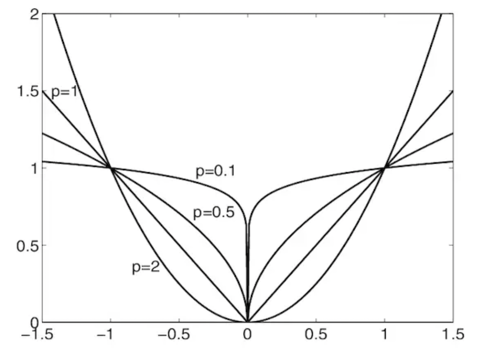

# 范数、正则化
- [范数、正则化](#范数正则化)
  - [范数的定义](#范数的定义)
    - [范数的应用](#范数的应用)
  - [范数作为损失函数](#范数作为损失函数)
  - [范数用于正则化](#范数用于正则化)

## 范数的定义
范数 (`norm`) 一般是用于衡量一个向量的大小，向量 $\boldsymbol{x}$ 的 $l_p$ 范数定义为
$$\begin{aligned}
    ||\boldsymbol{x}||_p=\sqrt[p]{\sum_i |x_i|^p}=(\sum_i |x_i|^p)^{\frac{1}{p}},\quad p\in\mathbb{R},p\geq 1
\end{aligned}$$

$l_p$ 范数与闵可夫斯基距离定义一样

- $L_0$ 范数: 向量 $\boldsymbol{x}$ 的 $l_0$ 范数定义为

$$\begin{aligned}
    ||\boldsymbol{x}||_0=\sqrt[0]{\sum_i |x_i|^0}
\end{aligned}$$

$l_0$ 范数表示向量 $\boldsymbol{x}$ 中非0元素的个数，即 $||\boldsymbol{x}||_0=\#(i|x_i\neq 0)$。

$l_0$ 范数是一个 NP-hard 问题，并且是一个非凸的问题，所以无法用凸函数的方法求解，因此在求解 $l_0$ 范数，一般会用 $l_1$ 范数来替代。

- $L_1$ 范数: 向量 $\boldsymbol{x}$ 的 $l_1$ 范数定义为

$$\begin{aligned}
    ||\boldsymbol{x}||_1=\sum_i |x_i|
\end{aligned}$$

$l_1$ 范数用于距离度量时，也叫做[曼哈顿距离](https://baike.baidu.com/item/曼哈顿距离/743092)

$l_1$ 范数表示向量中全部元素绝对值之和

- $L_2$ 范数: 向量 $\boldsymbol{x}$ 的 $l_2$ 范数定义为
$$\begin{aligned}
    ||\boldsymbol{x}||_2=\sqrt{\sum_i |x_i|^2}
\end{aligned}$$

$l_2$ 范数用于距离度量时，也叫做[欧式距离](https://baike.baidu.com/item/欧几里得度量/1274107?fromtitle=欧氏距离&fromid=1798948&fr=aladdin)。表示从原点出发到向量 $\boldsymbol{x}$ 确定的点的距离。

- $L_\infty$ 范数: 向量 $\boldsymbol{x}$ 的 $l_\infty$ 范数定义为
$$\begin{aligned}
    ||\boldsymbol{x}||_\infty=\max_i |x_i|
\end{aligned}$$

$l_\infty$ 范数用于距离度量时，也叫做[切比雪夫距离](https://baike.baidu.com/item/切比雪夫距离)

此外还有关于矩阵范数的定义，具体可参考《矩阵论》教材

### 范数的应用

$l_1$ 和 $l_2$ 范数应用主要分为两类
- 作为损失函数
- 用于正则化， L1-regularization 和 L2-regularization

## 范数作为损失函数
- $L_1$ 范数损失函数
  
$L_1$ 范数损失函数，也称为最小绝对偏差 (Least Absolute Deviation,LAD) 、最小绝对误差 (Least Absolute Error,LAE) 
$$\begin{aligned}
    Loss_{L1}(x,y)=\sum_{i=1}^n |y_i-\hat{y_i}|
\end{aligned}$$
$y_i$ 是真实值， $\hat{y_i}=f(x_i)$ 是预测值

- $L_2$ 范数损失函数
  
$L_2$ 范数损失函数，也称为最小均方偏差 (Least Squared Deviation,LSD) 、最小均方误差 (Least Squared Error,LSE) 
$$\begin{aligned}
    Loss_{L2}(x,y)=\sum_{i=1}^n (y_i-\hat{y_i})^2
\end{aligned}$$

## 范数用于正则化

- $L_1$ 正则化
  
$L_1$ 正则化一般用来进行特征选择，防止过拟合(over fitting)，原因是L1正则化能够使得很多参数为0，从而产生稀疏解
$$\begin{aligned}
    L=L(W)+\lambda\sum_{i=1}^n|\omega_i|
\end{aligned}$$
$y_i$ 是真实值， $\hat{y_i}=f(x_i)$ 是预测值

- $L_2$ 正则化
  
$L_2$ 正则化
$$\begin{aligned}
    L=L(W)+\lambda\sum_{i=1}^n\omega_i^2
\end{aligned}$$

以$l_2$ 范数作为正则项可以得到稠密解

<!-- 
https://zhuanlan.zhihu.com/p/26884695
https://zhuanlan.zhihu.com/p/137073968
https://www.jianshu.com/p/6cf5d60db634
 -->