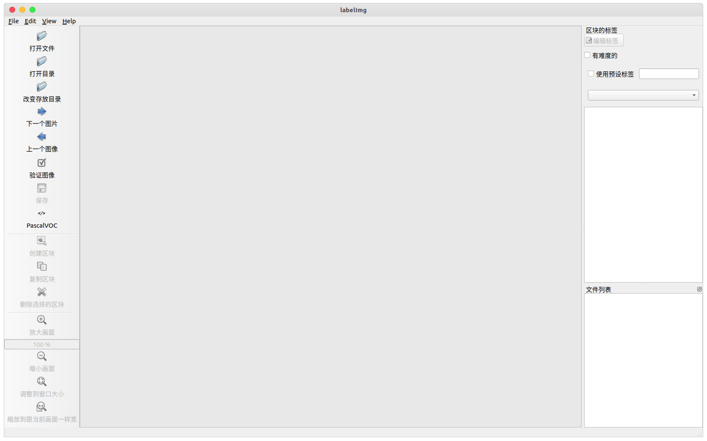
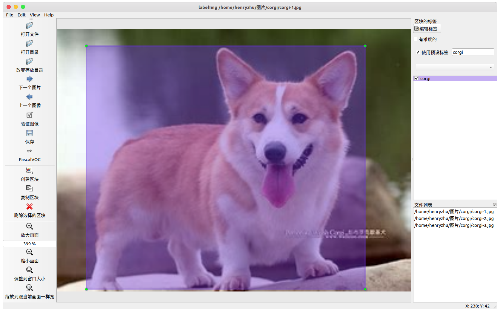

# 目标检测数据集
- [目标检测数据集](#目标检测数据集)
  - [数据集制作](#数据集制作)
    - [数据搜集与归档](#数据搜集与归档)
    - [数据预处理](#数据预处理)
  - [数据标注](#数据标注)


目标检测数据集有两类
1. **单目标数据集** 指的是数据集中每一张图片中仅有一个目标
2. **多目标数据集** 指的是数据集中每一张图片中有多个目标（可以是同类目标也可以是不同类的目标）

在处理这两种数据的思路上略有不同


## 数据集制作
下面假设数据集命名为 `dataset-custom` ，可以根据实际情况修改
### 数据搜集与归档
将采集到的数据放置在 `dataset-custom/src` 目录下面，并且按照类别归档至对应文件夹下，参考的文件目如下
```bash
·
└── dataset-custom  # dataset directory
    └── src         # source images directory
        ├─ A        # class A
        ├─ B        # class B
        └─ ...
```
### 数据预处理
一般用于训练的图片不会超过 1920*1080 的大小，所以需要对图像进行预处理，包括
1. 图像压缩大小 （等比例压缩，不改变原始图像的比例）
2. 按照 `类名+编号` 文件重命名
```shell
·
└── dataset-custom  # dataset directory
    └── src           -->   labeled
        ├─ A          -->   ├─A
        │ ├ ****.jpg  -->   │ ├ A-0001.jpg (1920*1080)
        │ ├ ****.jpg  -->   │ ├ A-0002.jpg (1920*1080)
        │ └─ ...            │ └─  ...
        ├─ B          -->   ├─ B
        └─ ...              └─ ...
```

处理完成后得到 `labeled` 的目录
```shell
·
└── dataset-custom  # dataset directory
  ├── src           # source images directory
  │ ├─ A            # class A
  │ ├─ B            # class B
  │ └─ ...
  └─ labeled        # preprocess
    ├─ A
    ├─ B
    └─ ...
```

`labeled` 目录是用于后续步骤[数据标注](#数据标注)的目录，这样我们可以在不破坏原始数据对情况下完成数据处理，如果不再需要原始数据，在完成此步骤后，可以删除 `src` 目录


## 数据标注
在前面步骤中生成的 `labeled` 目录是用于数据标注的目录，你可以选择使用图像注释工具 labelImg 来快速进行标注。

[labelImg](https://github.com/tzutalin/labelImg) 是 Python 编写、基于 Qt 图形界面的软件，标注以 `PASCAL VOC` 格式（ImageNet 使用的格式）另存为 `.xml` 文件。

> 此外，它还支持 `YOLO`, `CreateML` 格式。但是实际标注的时候仍然推荐使用 `PASCAL VOC` 格式进行标准，然后将 `PASCAL VOC` 格式转换成其他格式的数据


通过 `pip3` 安装 (或[源码编译](https://github.com/tzutalin/labelImg)的方式)
```shell
pip3 install labelImg
```
> 某些新架构的芯片可能出现 `pyqt5` 安装失败的情况，需要借助 [`brew`](https://brew.sh) 来[安装](https://formulae.brew.sh/formula/pyqt#default)

安装后，可以在命令行启动
```shell
labelImg
```

启动界面如下


<!--  -->

- 打开文件 : 标注单张图像（不推荐使用）
- **打开目录** : 打开数据集存放的目录，目录下应该是图像的位置
- **改变存放目录**: 标注文件 `.xml` 存放的目录
- 下一个图片: 
- 上一个图像: 
- **验证图像**: 验证标记无误，用于全部数据集标记完成后的检查工作
- **保存**: 保存标记结果，快捷键 `Ctrl+s`
- **数据集格式**: `PascalVOC` 和 `YOLO` 可选，一般选择 `PascalVOC` 即可，需要 `YOLO` 可以之后进行转换

点击 `创建区块` 创建一个 矩形框，画出范围


每个类别都有对应的颜色加以区分


完成一张图片的标注后，点击 `下一个图片`

- labelImg 快捷键

| 快捷键 |           功能           | 快捷键 |       功能       |
| :----: | :----------------------: | :----: | :--------------: |
| Ctrl+u |    从目录加载所有图像    |   w    |  创建一个矩形框  |
| Ctrl+R |   更改默认注释目标目录   |   d    |    下一张图片    |
| Ctrl+s |     保存当前标注结果     |   a    |    上一张图片    |
| Ctrl+d |   复制当前标签和矩形框   |  del   | 删除选定的矩形框 |
| space  |  将当前图像标记为已验证  | Ctrl+  |       放大       |
|  ↑→↓←  | 键盘箭头移动选定的矩形框 | Ctrl–  |       缩小       |
