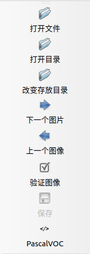
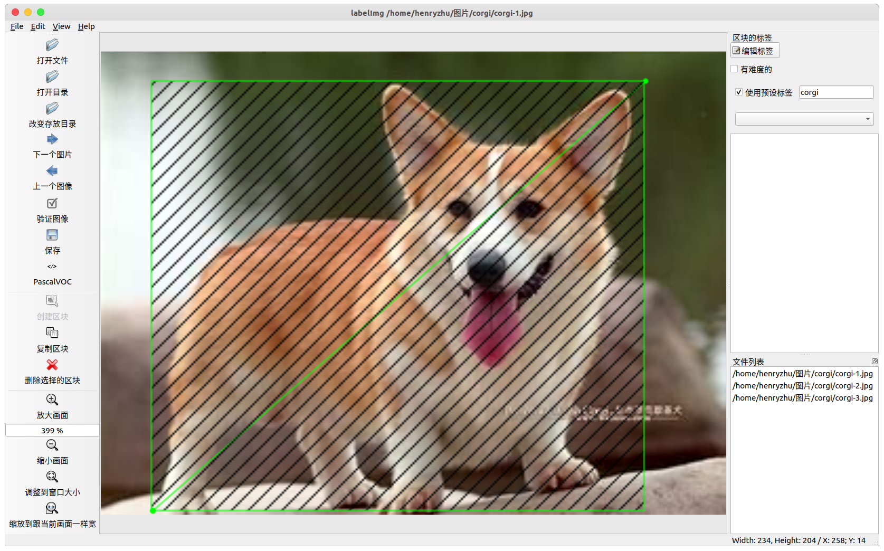

# 目标检测

## 目标检测任务

## 数据集制作

### 数据采集与归档

在任意位置新建数据集目录 `dataset-custom` (名称可以自定) 。
将原始图像数据放置在 `dataset-custom/src` 下，按照类别归档至对应目录下，参考目录如下

```sh
·
└── dataset-custom  # dataset directory
    └── src         # source images directory
        ├─ A        # class A
        ├─ B
        └─ ...
```


### 数据标注

在前面步骤中生成的 `labeled` 目录是用于数据标注的目录，你可以选择使用图像注释工具 labelImg 来快速进行标注。

[labelImg](https://github.com/tzutalin/labelImg) 是 Python 编写、基于 Qt 图形界面的软件，标注以 PASCAL VOC 格式（ImageNet 使用的格式）另存为 `.xml` 文件。此外，它还支持 YOLO 格式。

你可以通过从[源码编译](https://github.com/tzutalin/labelImg)的方式安装，也可以通过 pip3 快速安装
```bash
pip install labelImg
```

安装后，可以在命令行启动
```bash
labelImg
```

在 Ubuntu 下启动后的界面如下（Windows 版本可能略有差异）


<!--  -->

- 打开文件 : 标注单张图像（不推荐使用）
- **打开目录** : 打开数据集存放的目录，目录下应该是图像的位置
- **改变存放目录**: 标注文件 `.xml` 存放的目录
- 下一个图片: 
- 上一个图像: 
- **验证图像**: 验证标记无误，用于全部数据集标记完成后的检查工作
- **保存**: 保存标记结果，快捷键 `Ctrl+s`
- **数据集格式**: `PascalVOC` 和 `YOLO` 可选，一般选择 `PascalVOC` 即可，需要 `YOLO` 可以之后进行转换

点击 `创建区块` 创建一个 矩形框，画出范围


每个类别都有对应的颜色加以区分


完成一张图片的标注后，点击 `下一个图片`

- labelImg 快捷键

| 快捷键 |           功能           | 快捷键 |       功能       |
| :----: | :----------------------: | :----: | :--------------: |
| Ctrl+u |    从目录加载所有图像    |   w    |  创建一个矩形框  |
| Ctrl+R |   更改默认注释目标目录   |   d    |    下一张图片    |
| Ctrl+s |     保存当前标注结果     |   a    |    上一张图片    |
| Ctrl+d |   复制当前标签和矩形框   |  del   | 删除选定的矩形框 |
| space  |  将当前图像标记为已验证  | Ctrl+  |       放大       |
|  ↑→↓←  | 键盘箭头移动选定的矩形框 | Ctrl–  |       缩小       |
