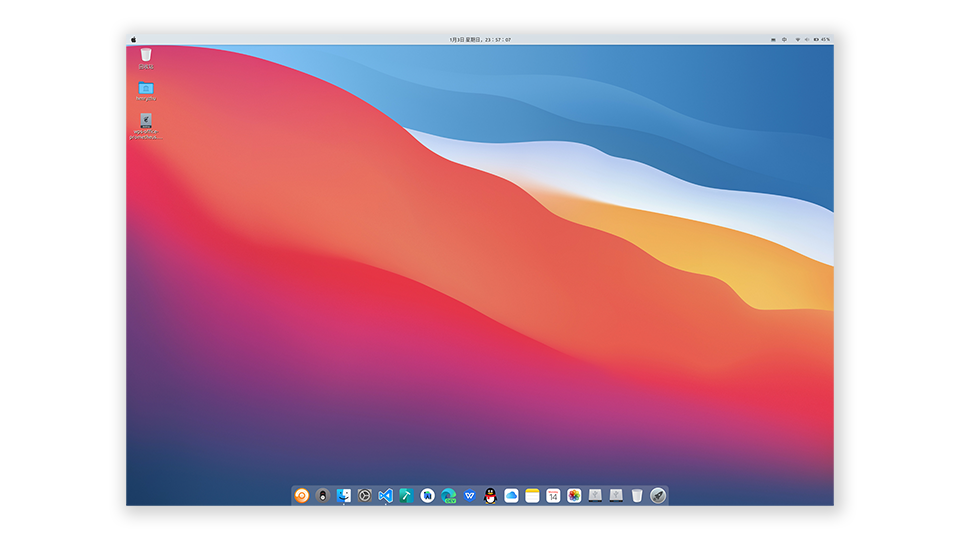
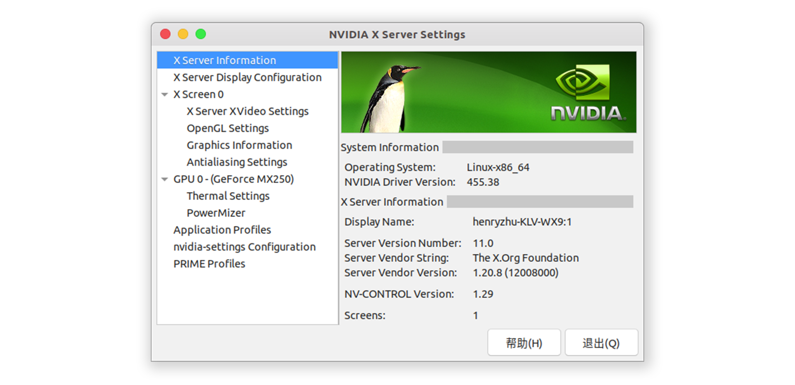

# 目录
- [目录](#目录)
  - [Linux 基础](#linux-基础)
    - [环境变量](#环境变量)
    - [软链接](#软链接)
  - [tmux](#tmux)
  - [vim](#vim)
  - [内网穿透](#内网穿透)
  - [系统安装](#系统安装)
    - [WSL (Windows Subsystem for Linux)](#wsl-windows-subsystem-for-linux)
  - [软件](#软件)
    - [更换软件源](#更换软件源)
    - [安装常用的软件](#安装常用的软件)
  - [Ubuntu 桌面美化](#ubuntu-桌面美化)
  - [Linux 配置深度学习环境](#linux-配置深度学习环境)
  - [Linux 下 OpenCV 源码编译](#linux-下-opencv-源码编译)

## Linux 基础
[Linux 基础](basic/basic.md)

### 环境变量
[环境变量](basic/basic.md#环境变量)
### 软链接
[软链接](basic/basic.md#软链接)

## tmux
[tmux](tmux/tmux.md)

## vim
[vim](./vim/vim.md)

## 内网穿透

[frp](./frp/frp.md)

## 系统安装

### WSL (Windows Subsystem for Linux)
WSL 是在 Windows 10 上安装适用于 Linux 的 Windows 子系统。可以基本取代虚拟机的方案。
- [如何安装 WSL](wsl2/wsl2.md)
- [更新软件源](#ubuntu-更换软件源)

## 软件

### 更换软件源
- [Ubuntu 更换 apt 源](./ubuntu/ubuntu.md#更换软件源)

### 安装常用的软件
- [Ubuntu 安装常用的软件](./ubuntu/ubuntu.md#软件安装)

## Ubuntu 桌面美化
如何将 [Ubuntu 界面 MacOS 化](./ubuntu/ubuntu.md#界面美化)

## Linux 配置深度学习环境
[Linux 下 配置深度学习环境](nvidia/cuda_cudnn.md)

## Linux 下 OpenCV 源码编译
[Linux 下 OpenCV 源码编译](opencv/opencv.md)

如果需要 OpenCV 和 CUDA 联合编译，那需要先安装 CUDA ，参考 [Linux 下 Nvidia 安装](#linux-下-nvidia-安装)

