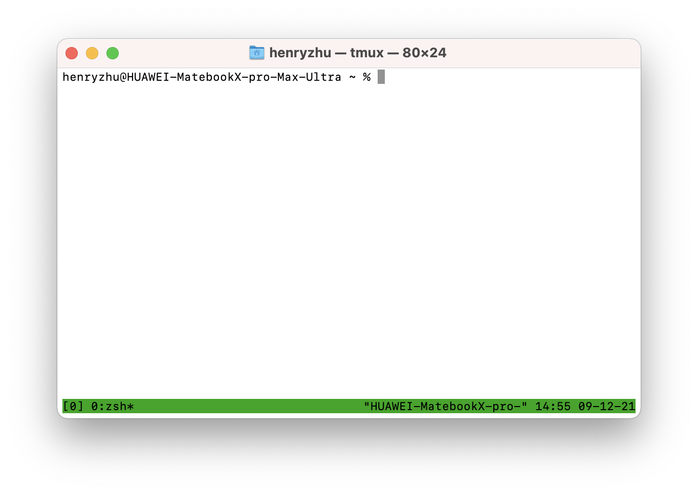
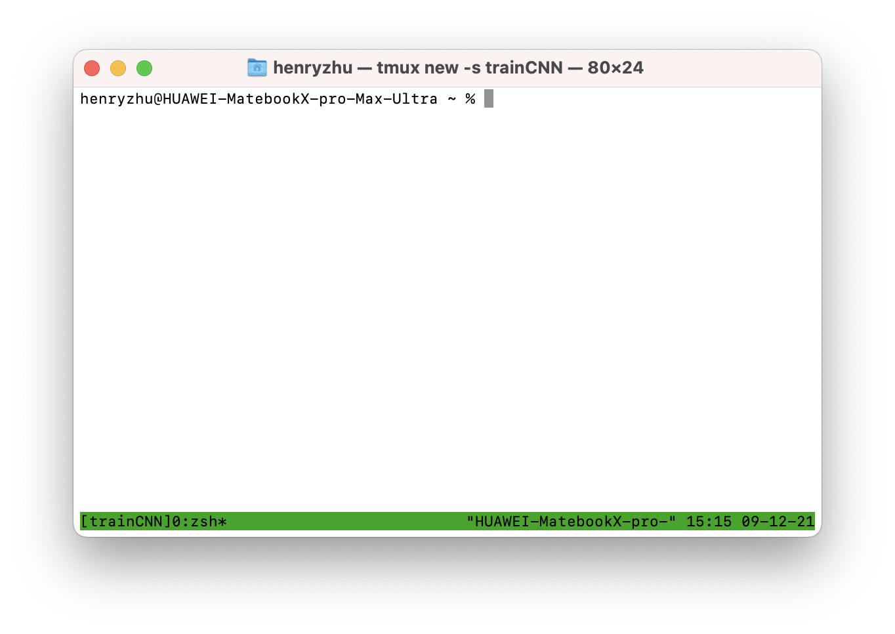
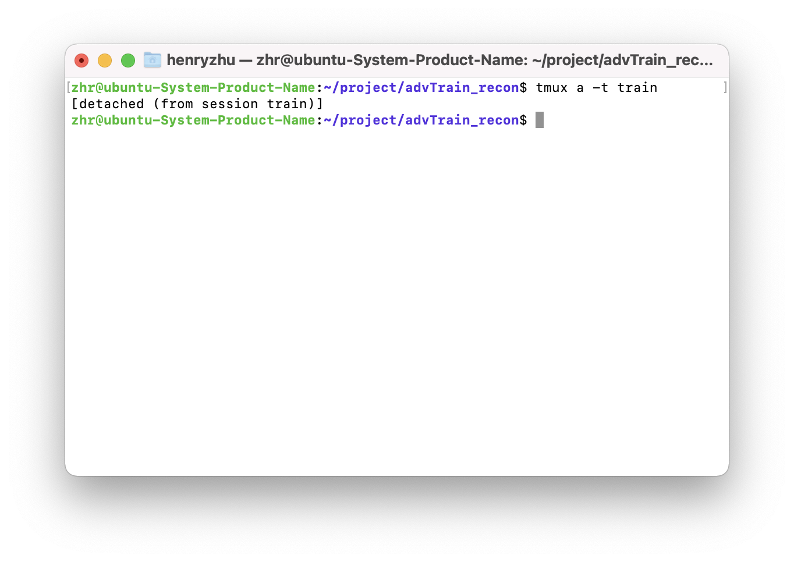
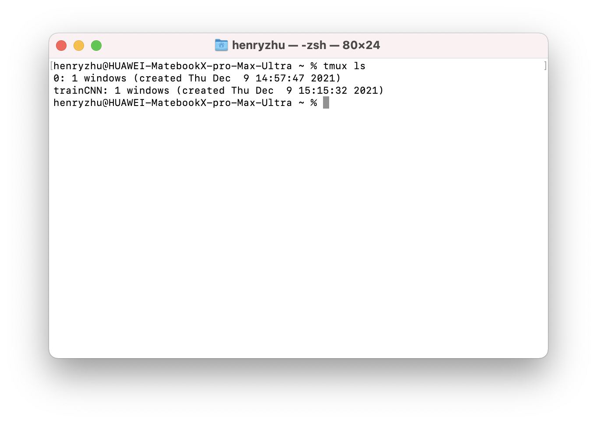
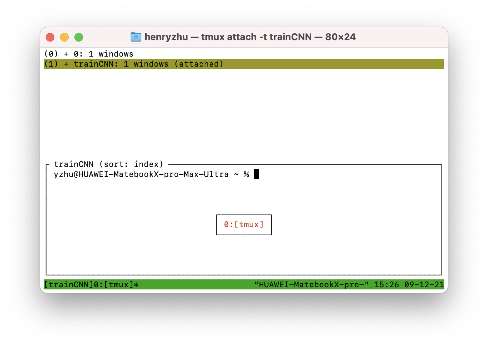
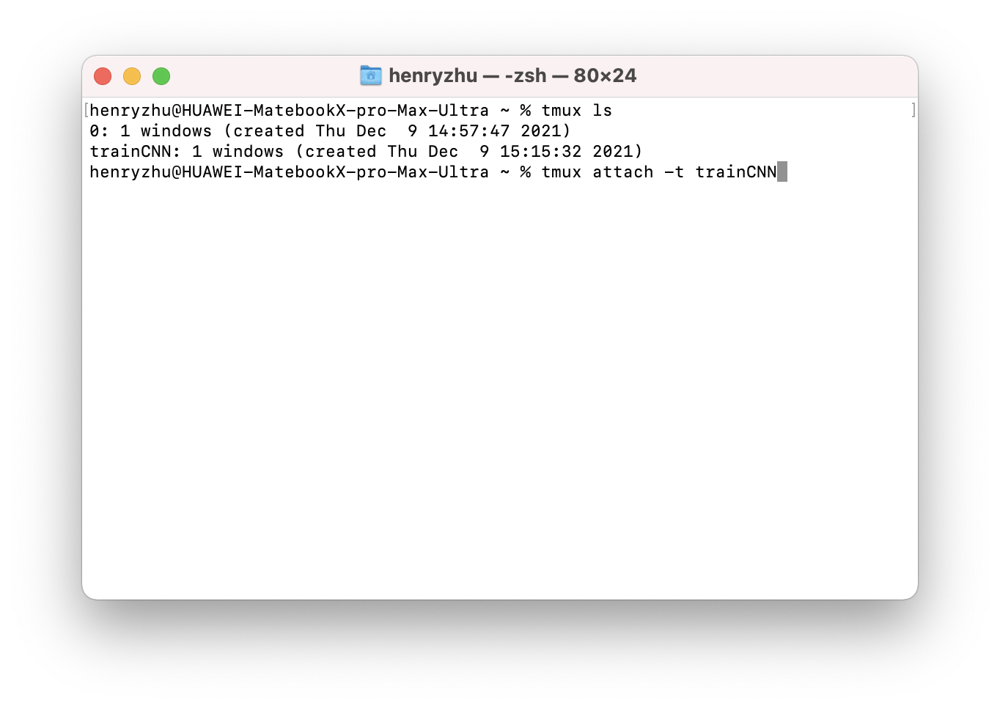
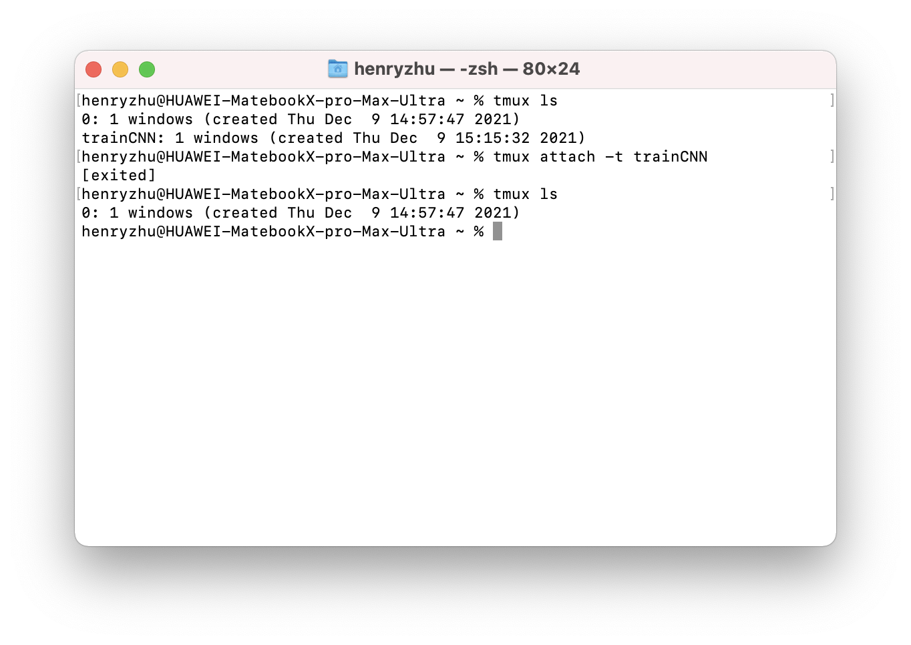

# tmux

- [tmux](#tmux)
  - [tmux 安装](#tmux-安装)
  - [tmux 中的名称与前缀键](#tmux-中的名称与前缀键)
  - [tmux 的会话管理](#tmux-的会话管理)
    - [新建会话](#新建会话)
    - [挂起会话](#挂起会话)
    - [查看会话](#查看会话)
    - [进入会话](#进入会话)
    - [退出会话](#退出会话)
    - [切换会话](#切换会话)
    - [重命名会话](#重命名会话)
  - [窗格管理](#窗格管理)
    - [划分窗格](#划分窗格)
    - [切换窗格](#切换窗格)
  - [窗口管理](#窗口管理)
  - [快捷键](#快捷键)


## tmux 安装

```shell
# Mac
brew install tmux

# Ubuntu/Debian
sudo apt install -y tmux
```

## tmux 中的名称与前缀键

在 tmux 中，有三个基本的概念
- session : 会话/任务
- window  : 窗口
- pane    ：窗格


在 tmux 中，使用快捷键是使用 `ctrl+B` 去唤起快捷键的 (MacOS 中则是 `control+B`)，叫**前缀键**

> [!NOTE|label:很重要的快捷键操作指南]
> 例如挂起 session 的快捷键是 `ctrl+B d` 。意思是，先按下前缀键 `ctrl+B` 唤起快捷键操作，然后接着按下 `d` 进行相应操作

## tmux 的会话管理
### 新建会话

新建一个默认的 session 
```shell
tmux
```


这时候新建一个默认的 session ，底部有一个状态栏。左侧 `[0] 0:zsh*` 是窗口编号、名称和终端信息，右侧是当前的系统信息。


为了方便 session 的管理，在新建 session 时，（推荐）指定名称
```shell
tmux new -s <session_name>

# example : create a session to train CNN
tmux new -s trainCNN
```


这时候的 session 名称就是 `trainCNN` 了， `[trainCNN]0:zsh*`

### 挂起会话
当想要挂起一个 session 让其在后台继续工作而不是退出的时候
```shell
tmux detach
```
快捷键 `ctrl+B d`



这时候该 session 会继续挂在后台运行继续执行任务 (显示为 `[detach (from seesion xxx)]`)，直到再次被唤起或被 kill 掉。

### 查看会话
我们想查看当前 tmux 挂在后台的 session 时，可以
```shell
tmux list-sessions
# or 
tmux ls -F trainCNN
```
快捷键 `ctrl+B s`



如果已经在某个 session 内的时候，可以通过快捷键 `ctrl+B s` 来查看，黄色高光部分就是当前正在运行的 session



### 进入会话
当我们想要进入一个 session 的时候，可以通过 session 的编号或者名字来进入
```shell
tmux attach -t <session_name>
```

例如当前运行的两个 session 分别是**编号为** `0` 和**名称为** `trainCNN` 的 session



我们想要进入其中一个 session 的时候，可以通过编号进入，也可以通过名称进入
```shell
tmux attach -t 0
tmux a -t 0

# example : resume trainCNN session
tmux attach -t trainCNN
```


### 退出会话
当完成任务后，需要彻底退出 session 而不是挂在后台的时候，可以
```shell
tmux kill-session -t <session_name>

# example : when finnished CNN training
tmux kill-session -t trainCNN
```

这时候 session 就会被 kill 掉，并且出现 `[exited]` ，表示已经退出了。在 `tmux ls` 查看 session 的时候，也不会有该 session 了

退出当前 session 的快捷键是  `ctrl+d`

### 切换会话

执行命令,可以从当前的 session 快速切换到另一个 session：
```shell
tmux switch -t <session_name>
```
### 重命名会话
```shell
tmux rename-session -t <old_session_name> <new_session_name>

# example : rename trainCNN to trainLSTM
tmux rename-session -t trainCNN trainLSTM
```
快捷键 `ctrl+b $`

## 窗格管理

### 划分窗格
- `Ctrl+b %`：划分左右两个窗格。
- `Ctrl+b "`：划分上下两个窗格。

### 切换窗格
`Ctrl+b <arrow key>`：光标切换到其他窗格。`<arrow key>`是指向要切换到的窗格的方向键，比如切换到下方窗格，就按方向键↓。
`Ctrl+b ;`：光标切换到上一个窗格。
`Ctrl+b o`：光标切换到下一个窗格。
`Ctrl+b {`：当前窗格与上一个窗格交换位置。
`Ctrl+b }`：当前窗格与下一个窗格交换位置。
`Ctrl+b Ctrl+o`：所有窗格向前移动一个位置，第一个窗格变成最后一个窗格。
`Ctrl+b Alt+o`：所有窗格向后移动一个位置，最后一个窗格变成第一个窗格。
`Ctrl+b x`：关闭当前窗格。
`Ctrl+b !`：将当前窗格拆分为一个独立窗口。
`Ctrl+b z`：当前窗格全屏显示，再使用一次会变回原来大小。
`Ctrl+b Ctrl+<arrow key>`：按箭头方向调整窗格大小。
`Ctrl+b q`：显示窗格编号。


## 窗口管理

<<<<<<< Updated upstream

新建窗口 `ctrl+b c`
重命名窗口 `ctrl+b ,`
关闭窗口 `ctrl+b x`
# 快捷键
=======
## 快捷键
>>>>>>> Stashed changes
