# Ubuntu
- [Ubuntu](#ubuntu)
  - [更换软件源](#更换软件源)
  - [双系统时间同步](#双系统时间同步)
  - [软件安装](#软件安装)
    - [Clang](#clang)
    - [Microsoft Edge](#microsoft-edge)
    - [GitHub Desktop](#github-desktop)
    - [deepin-wine](#deepin-wine)
    - [Lantern](#lantern)
  - [Ubuntu 修改 Grub 启动项](#ubuntu-修改-grub-启动项)
  - [界面美化](#界面美化)
    - [TweakTool](#tweaktool)
    - [安装 MacOS 主题样式](#安装-macos-主题样式)
    - [程序坞修改](#程序坞修改)
    - [最终效果](#最终效果)
- [WSL2 (Windows Subsystem for Linux)](#wsl2-windows-subsystem-for-linux)


## 更换软件源
换源可以参考各自官网的教程：
- [清华大学源(tuna)](https://mirrors.tuna.tsinghua.edu.cn/help/ubuntu/)
- [中国科学技术大学源(ustc)](http://mirrors.ustc.edu.cn/help/ubuntu.html)

Ubuntu 的软件源配置文件是 `/etc/apt/sources.list`，将系统自带的该文件做个备份
```bash
cd /etc/apt
sudo cp sources.list sources.list.bak
```

编辑配置文件，并保存
```bash
sudo vi sources.list
```


> 替换的镜像源可以从网站中找到，并且可以在网站上查看到使用帮助
> - [清华大学开源软件镜像站 Ubuntu 镜像使用帮助](https://mirrors.tuna.tsinghua.edu.cn/help/ubuntu/)
> - [中国科学技术大学源](http://mirrors.ustc.edu.cn/help/ubuntu.html)
> - [阿里源](https://developer.aliyun.com/article/751568)
> - [华为源（包括全部Linux发行版本）](https://mirrors.huaweicloud.com/home)

例如将 `ubuntu 20.04 LTS` 的软件源换为 `TUNA` 源，将文件替换为 [清华大学开源软件镜像站 Ubuntu 镜像使用帮助](https://mirrors.tuna.tsinghua.edu.cn/help/ubuntu/) 查询到源列表，即可使用 TUNA 的软件源镜像
```bash
deb https://mirrors.tuna.tsinghua.edu.cn/ubuntu/ focal main restricted universe 
deb https://mirrors.tuna.tsinghua.edu.cn/ubuntu/ focal-updates main restricted universe multiverse
deb https://mirrors.tuna.tsinghua.edu.cn/ubuntu/ focal-backports main restricted universe multiverse
deb https://mirrors.tuna.tsinghua.edu.cn/ubuntu/ focal-security main restricted universe multiverse
```

更新软件源列表并且更新软件
```bash
sudo apt update
sudp apt upgrade -y
```

当安装 `.deb` 软件出问题
```bash
sudo apt --fix-broken install
```

## 双系统时间同步
当电脑有多个系统的时候可能会存在时间差8小时的情况

更新软件源
```bash
sudo apt update
```

修改系统时间
```bash
timedatectl set-local-rtc 1 --adjust-system-clock
sudo apt install -y ntpdate
sudo ntpdate time.windows.com
sudo hwclock --localtime --systohc
```

## 软件安装
```bash
sudo apt install -y git gcc cmake tree
# 安装 GNU 编译器工具和 GDB 调试器
sudo apt-get install build-essential gdb
```
### Clang
下载 [LLVM 源码](https://releases.llvm.org/)
> [Getting Started: Building and Running Clang](https://clang.llvm.org/get_started.html)

Change directory to where you want the llvm directory placed.

安装依赖
```bash
sudo apt install -y git gcc cmake
```

下载源码
```bash
git clone https://github.com/llvm/llvm-project.git
git clone --depth=1 https://github.com/llvm/llvm-project.git
```

编译源码
```bash
cd llvm-project
mkdir build
cd build
cmake ../llvm \
  -DLLVM_ENABLE_PROJECTS="clang;libcxx;libcxxabi" \
  -DCMAKE_BUILD_TYPE=Release \
  -DCMAKE_INSTALL_PREFIX=~/programs/llvm
make -j8
```
- `-DLLVM_ENABLE_PROJECTS="..."`: clang, clang-tools-extra, libcxx, libcxxabi, libunwind, lldb, compiler-rt, lld, polly, or debuginfo-tests
- `-DCMAKE_INSTALL_PREFIX=<install_path>` : default=`/usr/local`

安装
```bash
make install
```

### Microsoft Edge
在 [Microsoft Edge Insider Channels](https://www.microsoftedgeinsider.com/zh-cn/download/?platform=linux) 下载 Edge 预览版

或者可以通过 apt 包管理软件来下载 ：

添加微软的软件源
```bash
curl https://packages.microsoft.com/keys/microsoft.asc | gpg --dearmor > microsoft.gpg
sudo install -o root -g root -m 644 microsoft.gpg /etc/apt/trusted.gpg.d/
sudo sh -c 'echo "deb [arch=amd64] https://packages.microsoft.com/repos/edge stable main" > /etc/apt/sources.list.d/microsoft-edge-dev.list'
sudo rm microsoft.gpg
```

更新软件源并且安装
```bash
sudo apt update
sudo apt install -y microsoft-edge-dev
```


### GitHub Desktop
[GitHub Desktop - The Linux Fork](https://github.com/shiftkey/desktop)

添加软件源
```bash
wget -qO - https://packagecloud.io/shiftkey/desktop/gpgkey | sudo tee /etc/apt/trusted.gpg.d/shiftkey-desktop.asc > /dev/null
sudo sh -c 'echo "deb [arch=amd64] https://packagecloud.io/shiftkey/desktop/any/ any main" > /etc/apt/sources.list.d/packagecloud-shiftky-desktop.list'
```

更新软件源并且安装
```bash
sudo apt install -y github-desktop
```

### deepin-wine
> 参考 [deepin-wine](https://github.com/zq1997/deepin-wine) 项目

首次使用时，你需要运行如下一条命令将移植仓库添加到系统中
```bash
wget -O- https://deepin-wine.i-m.dev/setup.sh | sh
```
> 同时尽量将 `main` `restricted` `universe` `multiverse` 这几个系统源都启用（自行百度），免得依赖问题多

自此以后，你可以像对待普通的软件包一样，使用`apt-get`系列命令进行各种应用安装、更新和卸载清理了

将`com.qq.weixin.deepin`替换为需要安装的包名即可，参考[完整的软件列表](https://deepin-wine.i-m.dev/)，例如
```bash
# 微信
sudo apt install -y com.qq.weixin.deepin
# QQ
sudo apt install -y com.qq.im.deepin
# TIM
sudo apt install -y com.qq.office.deepin
# QQ音乐
sudo apt install -y com.qq.music.deepin
# QQ视频
sudo apt install -y com.qq.video.deepin
# 腾讯会议
sudo apt install -y com.tencent.meeting.deepin
# 爱奇艺
sudo apt install -y com.iqiyi.deepin
# 钉钉
sudo apt install -y com.dingtalk.deepin
# 阿里旺旺
sudo apt install -y com.taobao.wangwang.deepin
```

应用图标需要注销重登录后才会出现

卸载软件
```bash
sudo apt-get purge --autoremove <software>
```

其他问题参考官方的[常见问题](https://github.com/zq1997/deepin-wine#%E5%B8%B8%E8%A7%81%E9%97%AE%E9%A2%98)以解决

### Lantern
下载[蓝灯](https://github.com/getlantern/download)，自行选择是否购买[专业版](https://www.getlandeng605.org/)


## Ubuntu 修改 Grub 启动项

> 修改针对多系统的系统启动引导顺序
> 
```bash
sudo gedit /etc/default/grub
```

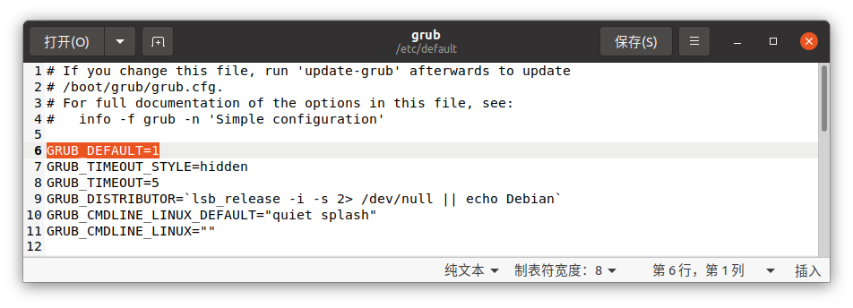

- `GRUB_DEFAULT` : 默认启动项，按列表的顺序，从0开始
- `GRUB_TIMEOUT` : 启动选择超时时间

修改完成后
```bash
sudo update-grub
```


## 界面美化
将 Ubuntu 的桌面包装成 MacOS 的模样，支持
[`Monterey(TODO)`](https://www.apple.com/macos/monterey-preview/)
/[`Bigsur`](https://www.apple.com.cn/macos/big-sur/)
/[`Catalina`](https://www.apple.com.cn/newsroom/2019/10/macos-catalina-is-available-today/)

### TweakTool
要安装主题，首先要先安装相应的工具 `TweakTool`
```bash
sudo apt update
sudo apt install -y gnome-tweak-tool
```
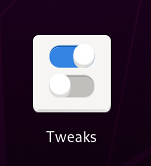


**改窗口的按钮位置**

- English: `Window Titlebars` -> `Titlebar Buttons` -> `Placement` -> `Left`
- 中文: `窗口标题栏` -> `标题栏按钮` -> `放置` -> `左`


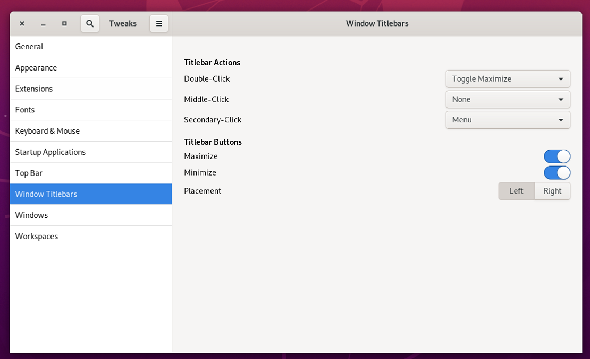


**修改Shell**

- English: `Appearance` -> `Themes` -> `Shell` 
- 中文: `外观` -> `主题` -> `Shell` 

发现有感叹号无法操作

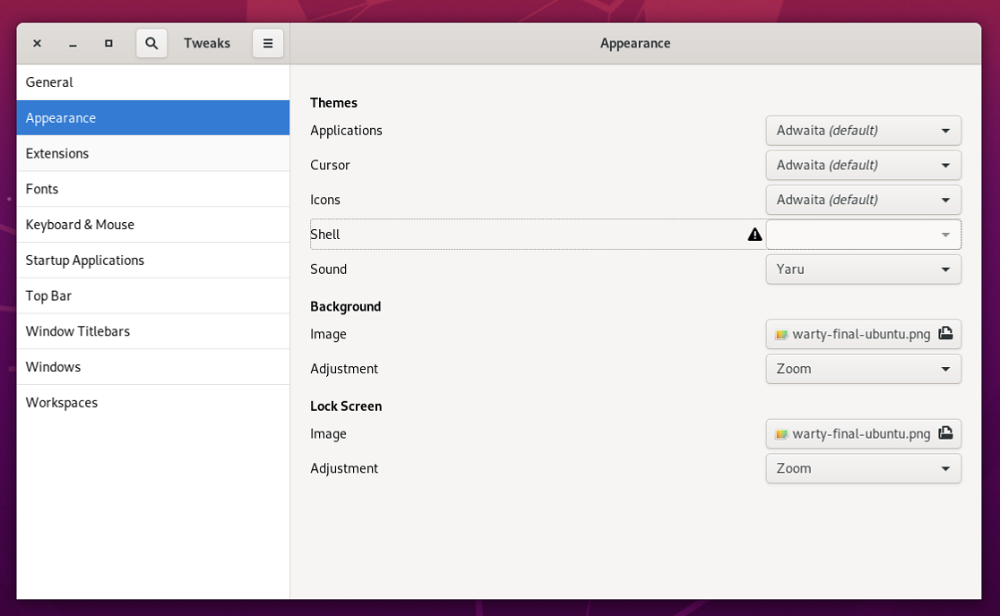

```bash
sudo apt install -y gnome-shell-extensions
```

在`扩展`中打开`User themes`的选项之后，就可以看到感叹号消失了，这时候就可以修改`Shell`了
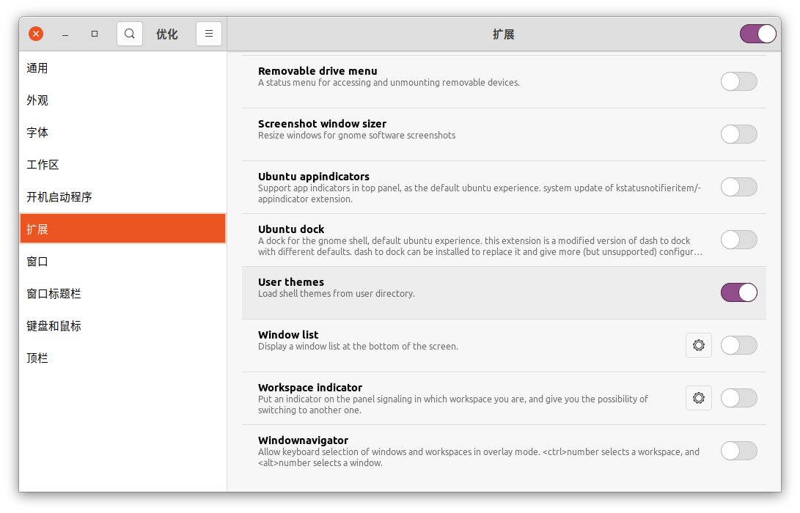
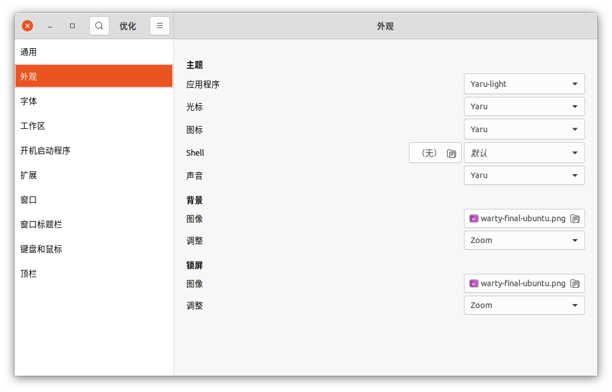

> 如果扩展中没有 `User themes` 选项，则可能需要`reboot`重启设备
> `User themes` 选项之后如果感叹号仍然没有消失，那么需要重新打开该软件


### 安装 MacOS 主题样式
- MacOS Monterey
  - 壁纸 
  - grub 主题 : [MacOS Monterey inspired grub theme](https://www.opendesktop.org/p/1577873/)
- Big Sur
  - [MacOS-3D-Originals-Gtk](https://www.opendesktop.org/p/1410476/)
  - [MacOS-3D-Originals-Icons](https://www.opendesktop.org/p/1412504/)
  - [macOS Big Sur:Cursors](https://www.opendesktop.org/p/1408466/)
  - [MacOS-3D-Originals-Shell](https://www.opendesktop.org/p/1410510/)
  - [Cupertino iCons CollectionOriginal](https://www.opendesktop.org/s/Gnome/p/1102582/)
- Catalina
  - [McHigh Sierra](https://www.opendesktop.org/s/Gnome/p/1013714/)
  - [McOS-themes](https://www.opendesktop.org/s/Gnome/p/1241688)
> BigSur主题已经打包到[Release](https://github.com/HenryZhuHR/someTutorials/releases/download/0.0/MacOS-BigSur.tar.gz)中，可以直接下载使用

上述下载的文件夹复制到对应的系统文件夹
- 主题 (themes)     : `/usr/share/themes`
- 图标 (icons)      : `/usr/share/icons`
- 终端 (shell)      : `/usr/share/themes`
- 背景 (background) : `/usr/share/backgrounds`


之后就可以修改对应的主题

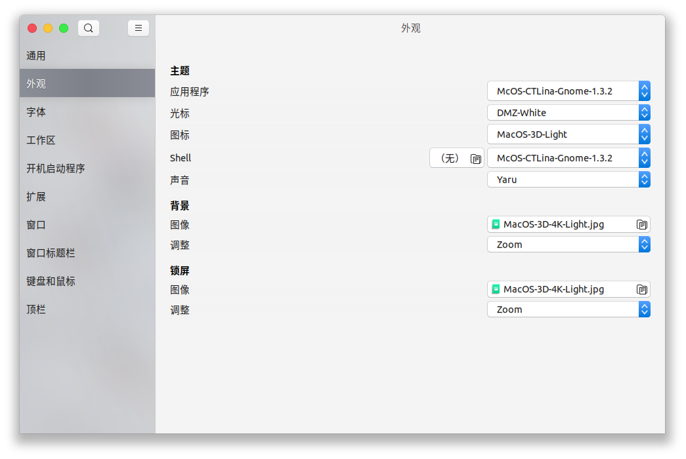


### 程序坞修改
**Dash to Dock**可以把程序坞变成 MacOS 的样子
```bash
sudo apt install -y chrome-gnome-shell
```

点击以下载 [dash to dock](https://extensions.gnome.org/extension/307/dash-to-dock/)，并且打开右上角的按钮

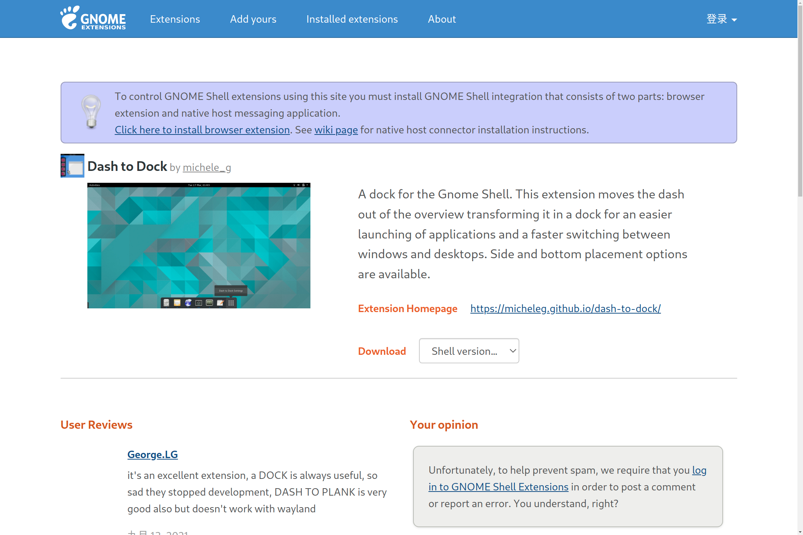

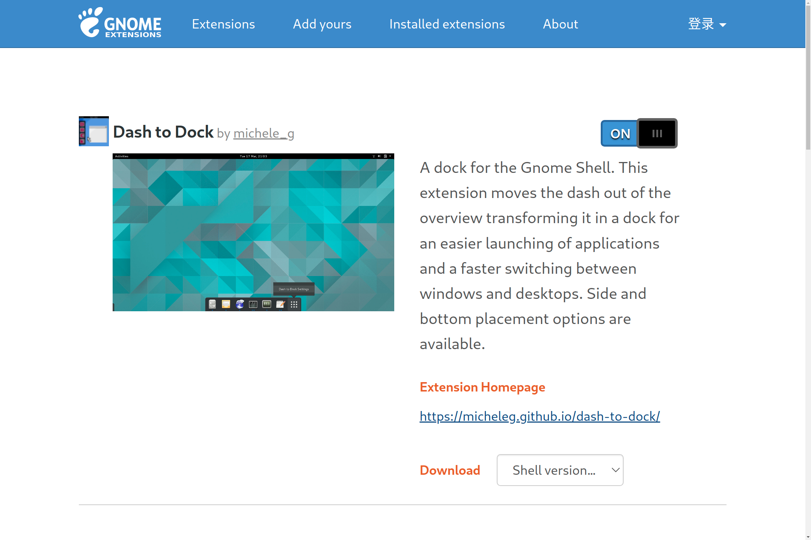

之后在`优化(TWeak)`中启动`dash to dock`

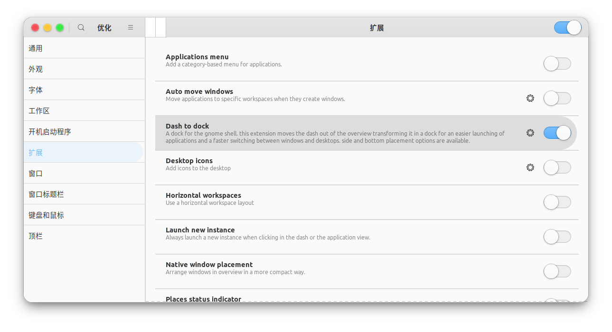

点击齿轮按钮，可以修改dock


### 最终效果

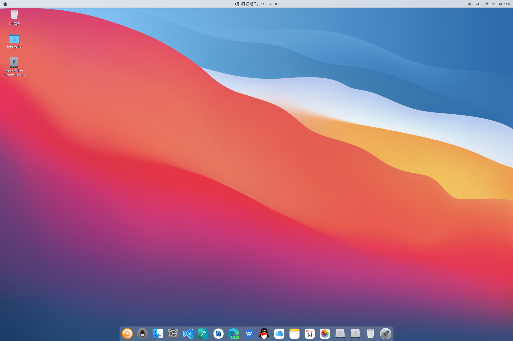

> **去掉默认密钥环的密码**
> 
> 打开应用程序－>附件－>密码和加密密钥（如果你的没有，在终端中输入 seahorse），切换到密码选项卡，会看到一个密码密钥环（我的密钥环是 login），
右击－>更改密码，然后在“旧密码”中填入系统登录密码，其他不用填，直接确定，并选择“使用不安全的存储器”，这样就可以去掉默认密钥环的密码了。


# WSL2 (Windows Subsystem for Linux)
参考官方的 [适用于 Linux 的 Windows 子系统文档](https://docs.microsoft.com/zh-cn/windows/wsl/) 安装 WSL2 (Windows Subsystem for Linux)组件

安装完成后，

到 `Microsoft Store` 中下载需要的Linux发行版本，这里选择[Ubuntu](https://www.microsoft.com/store/productId/9NBLGGH4MSV6)

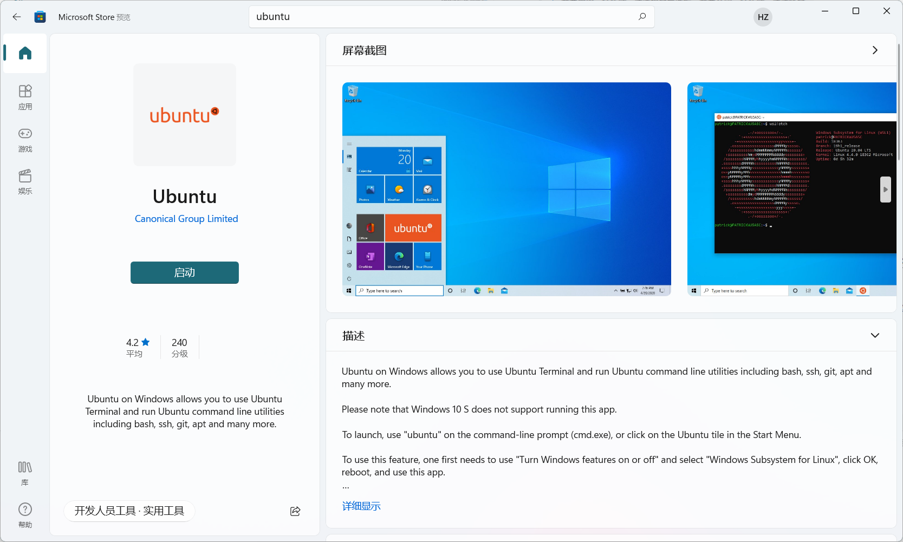

打开 PowerShell，然后在安装新的 Linux 发行版时运行以下命令，将 WSL 2 设置为默认版本
```bash
wsl --set-default-version 2
```

检查分配给每个已安装的 Linux 分发版的 WSL 版本
```bash
wsl --list --verbose
```

启动 Ubuntu 之后进行短暂的安装

> 推荐[Windows Terminal](https://www.microsoft.com/store/productId/9N0DX20HK701)，Windows Terminal 可以用于启动Ubuntu
> 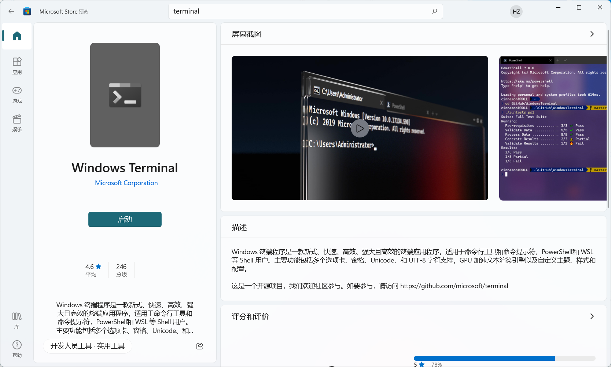


> [!TIP]
> 安装后你只能得到命令行的 Ubuntu，但可以通过自行装上 Gnome 桌面，如果不需要图形用户界面可以跳过以下全部部分

WSL 不支持 systemd 而 Gnome 桌面又是基于 systemd，所以先解决这个问题。（参考：ubuntu-wsl2-systemd-script 的解决方案）
```bash
sudo apt update
sudo apt install git
# Github
git clone --depth 1 https://github.com/HenryZhuHR/ubuntu-wsl2-systemd-script.git
# Gitee
git clone --depth 1 https://gitee.com/HenryZhuHR/ubuntu-wsl2-systemd-script
cd ubuntu-wsl2-systemd-script
bash ubuntu-wsl2-systemd-script.sh
```
重新启动子系统，或者重启电脑也行。

```bash
sudo apt update
sudo apt install -y ubuntu-desktop
```
> 安装过程很漫长


安装 Xrdp
```bash
sudo apt install -y xrdp
sudo systemctl status xrdp
sudo adduser xrdp ssl-cert
```

**每次启动前运行的命令**！
```bash
sudo systemctl restart xrdp
```

查看一下配置文件中的端口（默认：3389）
```bash
cat /etc/xrdp/xrdp.ini
```

配置防火墙
```bash
sudo ufw allow 3389
```

登录远程桌面

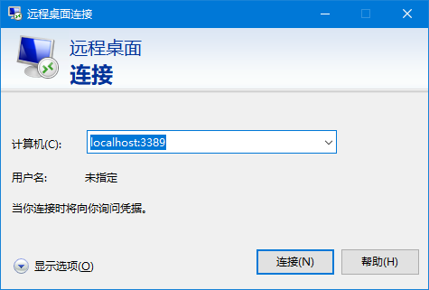


- **SSH 远程连接**

重装原有SSH
```bash
sudo apt remove openssh-server
sudo apt install openssh-server
```

> 先解释一下WSL的网络，作为子系统的Ubuntu Linux和Windows主系统的IP是一样的。如果在Linux上搭建了Nginx服务器，那么在Windows上的浏览器上输入localhost是可以访问Nginx服务的。如果在Linux上运行netstat -nlp是不会看到任何端口服务的。在Linux上启用端口服务的时候，Windows系统会弹出窗口，询问是否允许相关端口访问。

WSL上的Ubuntu默认安装了openssh-server，也就是ssh服务的软件。但是，这个软件的配置是不完整的，如果启用服务，会报缺失几个密钥文件。为了解决这个问题，我们需要重新安装openssh-server：

重新安装完还不行，因为WSL上的Ubuntu的SSH服务配置默认不允许密码方式登录，我们需要改配置：
更改配置文件
```bash
sudo vim /etc/ssh/sshd_config
```

将以下配置复制到sshd_config配置文件
```bash
Port 2222                   #设置ssh的端口号, 由于22在windows中有别的用处, 尽量不修改系统的端口号
PermitRootLogin yes         # 可以root远程登录
PasswordAuthentication yes  # 允许密码验证登录
AllowUsers ubutnu           # 远程登录时的用户名
```

重启sshd服务
```bash
sudo service ssh --full-restart
```

此时，我们可以在Ubuntu的Bash下连接自己测试，也可以用Windows的PowerShell连接Ubuntu来测试，命令都是一样的

测试连接
```bash
ssh username@localhost:2222 	# username为安装WSL Ubuntu时输入的用户名
```
如果要在其它机器上访问，需要查找本机IP，把localhost换成IP，那么同一子网（wifi、路由器）下的机器也可访问Ubuntu里的服务。
如果在其他机器上连接不成功看是不是Win10本地防火墙的2222端口没有放行，放行端口方法

- 防火墙->高级设置->入站规则->新建规则
- 端口->下一步
- 选择tcp 特定本地端口 2222
- 允许连接, 默认都选上, 下一步填个名字 完成
