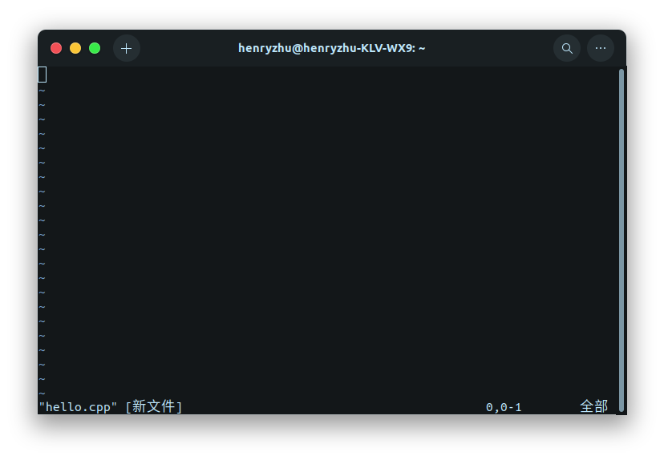
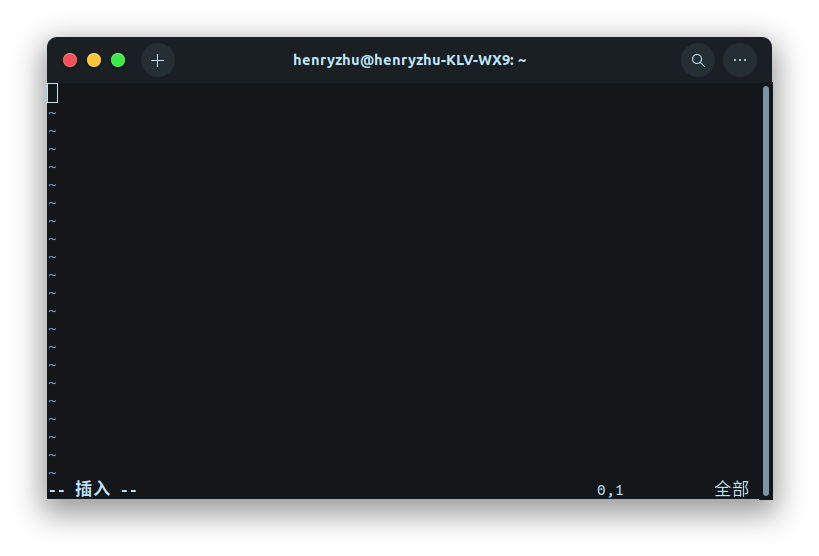
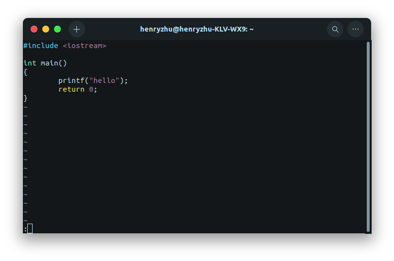

# Vi/Vim 
- [Vi/Vim](#vivim)
  - [三种模式](#三种模式)
    - [一般模式 (command mode)](#一般模式-command-mode)
    - [编辑模式 (insert mode)](#编辑模式-insert-mode)
    - [命令行模式 (command-line mode)](#命令行模式-command-line-mode)
  - [按键操作](#按键操作)
    - [一般模式按键操作](#一般模式按键操作)
      - [移动光标](#移动光标)
      - [查找操作](#查找操作)
    - [编辑模式按键操作](#编辑模式按键操作)
    - [命令行模式按键操作](#命令行模式按键操作)


## 三种模式
- [x] [一般模式 (command mode)](#一般模式-command-mode)
- [x] [编辑模式 (insert mode)](#编辑模式-insert-mode)
- [x] [命令行模式 (command-line mode)](#命令行模式-command-line-mode)


### 一般模式 (command mode)
一般模式(command mode)，也叫命令模式。在一般模式下
- 按 `i` 进入[编辑模式 (insert mode)](#编辑模式-insert-mode)
- 按 `:` 进入[命令行模式 (command-line mode)](#命令行模式-command-line-mode)

用 vi/vim 打开一个文件之后，会默认进入一般模式。
```bash
vi hello.cpp
```



一般模式下，可以移动光标，删除字符或者删除整行，也可以复制、粘贴文本内容
- 移动光标
- 删除字符
- 删除整行
- 复制文本
- 粘贴文本


### 编辑模式 (insert mode)
编辑模式(insert mode)，也叫插入模式，在这个模式下可以自由编辑文本内容。

在一般模式下，按 `i/I` `o/O` `a/A`(insert), `r/R`(replace) 任意一个可以进入编辑模式，编辑模式英文为 insert mode ，所以便于记忆，习惯用 `i` 进入编辑模式。其中 `r/R` 是进入编辑模式中的替换

在编辑模式下，按 `Esc` 退回[一般模式 (command mode)](#一般模式-command-mode)




### 命令行模式 (command-line mode)
命令行模式(command-line mode)，也叫末行模式。

在一般模式下，按 `:` 会进入命令行模式，可以在 `:` 之后输入需要进行的操作

在命令行模式下，删除 `:` 及其后字符，退回至[一般模式 (command mode)](#一般模式-command-mode)




## 按键操作

### 一般模式按键操作
#### 移动光标
- `h` 或 ⬅️ : 左移， 先后按下 `3` 和 `h` 左移3个字符
- `j` 或 ➡️ : 下移， `5j` 左移5行
- `k` 或 ⬆️ : 上移， `6k` 左移6个字符
- `l` 或 ⬇️ : 右移， `7l` 右移7两行
- `0` : 移动到当前行的最前
- `$` : 移动到当前行的最后
- `n+G` : 先输入数字 `n` 并按下 `G`(大写)，移动到当前文件的第n行。`gg`=`1G`，移动到首行
- `n+Enter` : 先输入数字 `n` 并按下 `Enter` ，向下移动n行
- `ctrl+f` : 屏幕向下移动一页
- `ctrl+b` : 屏幕向上移动一页
- `ctrl+d` : 屏幕向下移动半页
- `ctrl+u` : 屏幕向上移动半页

#### 查找操作
- `/word` : 查找光标之后的内容 `word` ，若要查找单词 `linux` ，输入 `/word` 即可
- `?word` : 查找光标之前的内容 `word`

查找后
- `n` : 重复前一个查找操作，查找下一个内容 `/` 则是向下， `？` 表示向上，理解为next
- `N` : 重复查找操作，与 `n` 操作相反


### 编辑模式按键操作
### 命令行模式按键操作
