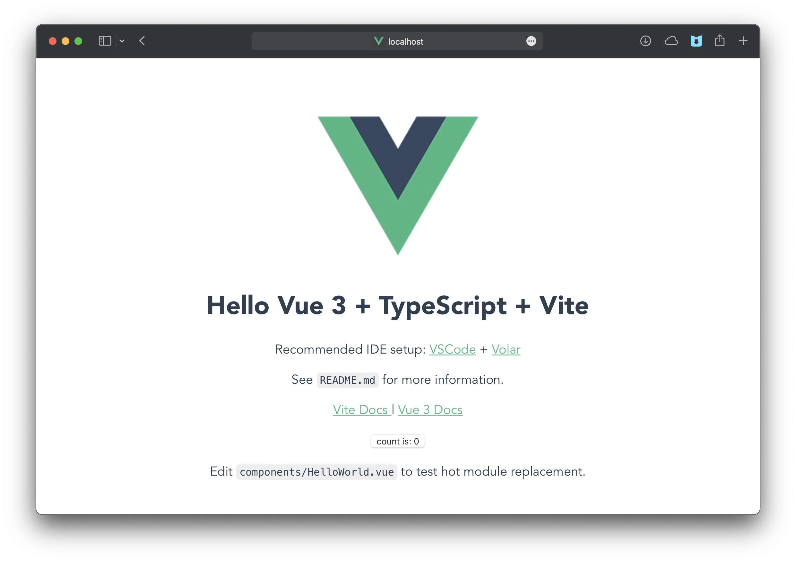
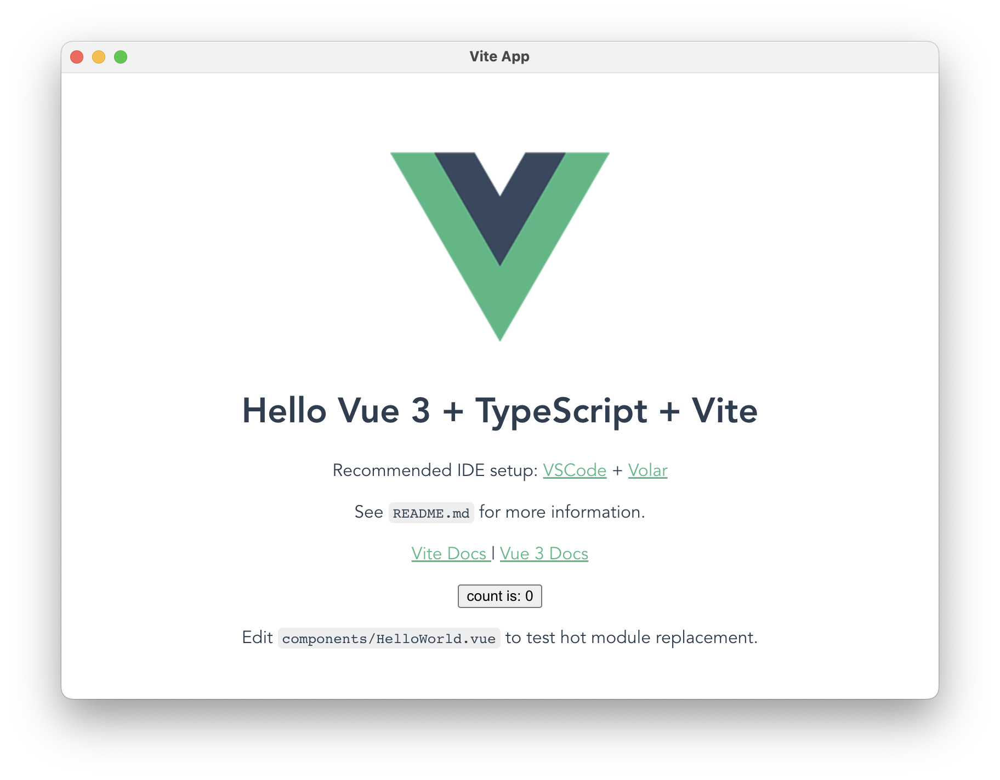
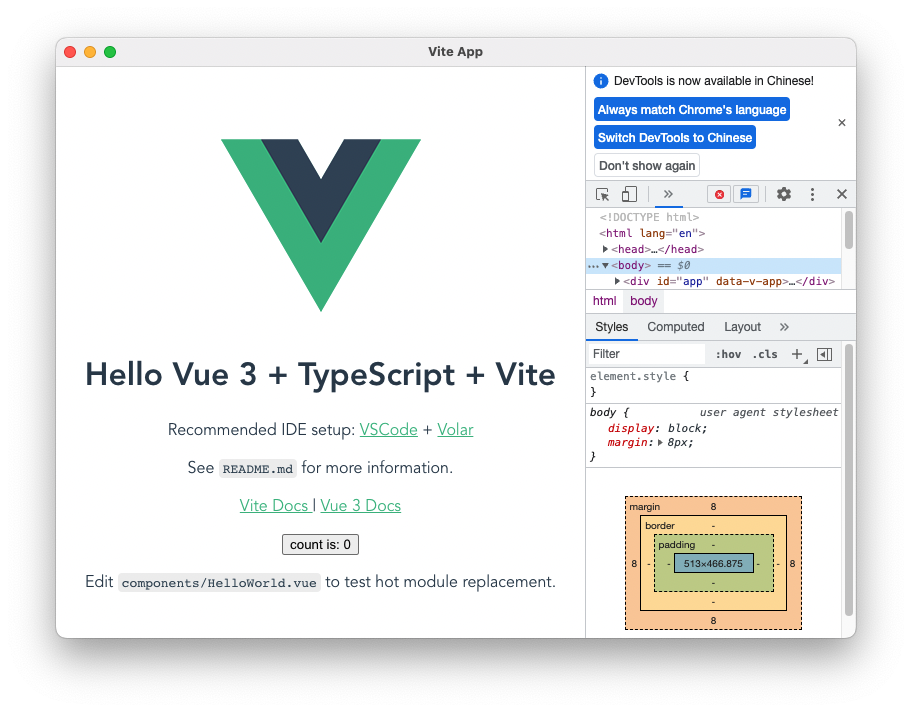

<!-- https://zhuanlan.zhihu.com/p/421460116 -->
# Vue + Vite + Electron 做一个跨平台的桌面应用程序

## 创建 Vite 项目

```sh
yarn create vite
```

设置项目名称，并且依次选择 `vue` `vue-ts` 作为模板：
```sh
✔ Project name: … vite-project
✔ Select a framework: › vue
✔ Select a variant: › vue-ts
```


<details>
  <div id="tree-root-directory-vite"></div>
  <summary>
    项目的目录结构
  </summary>

```sh
.
├── README.md
├── public
├── src
├── index.html
├── package.json
├── tsconfig.json
├── tsconfig.node.json
└── vite.config.ts
```
</details>


启动项目
```sh
cd vite-project
yarn
yarn dev
```


在 `vite.config.ts` 中添加 `base` 配置
```ts
import { defineConfig } from 'vite'
import vue from '@vitejs/plugin-vue'

// https://vitejs.dev/config/
export default defineConfig({
  base: "./",
  plugins: [vue()]
})
```

修改根目录下的 `index.html` 文件，添加
```html
<style>
    body {
      margin: 0;
      padding: 0;
    }
  </style>
```

<details>
  <summary>
    完整的<code>index.html</code>
  </summary>

@[code](./src/index.html)
</details>


## 项目中添加 Electron

### 添加 Electron 相关库
向新建的项目中添加 Electron
```sh
yarn add --dev electron@latest
```
> [Electron 官方文档](https://www.electronjs.org/zh/docs/latest)

为了使vite和electron正常运行，需要先运行vite，使得其开发服务器的url可以正常访问，然后再开启electron去加载url。

```sh
yarn add --dev concurrently wait-on
```
- `concurrently` 阻塞运行多个命令，-k参数用来清除其它已经存在或者挂掉的进程
- `wait-on` 等待资源，此处用来等待url可访问

### 创建一个 Electron 窗口
首先添加在 `package.json` 的根节点添加入口点，并且在 `scripts` 节点添加启动 electron 的脚本
```json
{
  "main": "main.js",
  "description": "Hello World!",
  "author": "your name",
  "scripts": {
    "electron": "wait-on tcp:3000 && electron .",
    "electron:serve": "concurrently -k \"yarn dev\" \"yarn electron\""
  }
}
```
> `author` 与 `description` 可为任意值，但对于[应用打包](https://www.electronjs.org/zh/docs/latest/tutorial/quick-start#package-and-distribute-your-application)是必填项。

然后[创建你的应用程序](https://www.electronjs.org/zh/docs/latest/tutorial/quick-start#创建你的应用程序)，在根目录下添加 Electron 启动入口文件 `main.js`

配置 [在窗口中打开您的页面](https://www.electronjs.org/zh/docs/latest/tutorial/quick-start#在窗口中打开您的页面) 部分，在 `main.js` 导入两个 Electron 模块
- [`app`](https://www.electronjs.org/zh/docs/latest/api/app) 模块，它控制应用程序的事件生命周期。
- [`BrowserWindow`](https://www.electronjs.org/zh/docs/latest/api/browser-window) 模块，它创建和管理应用程序窗口。
```js
const { app, BrowserWindow } = require('electron')
```


然后，在 `main.js` 添加一个 `createWindow()` 方法来加载浏览器页面的 `BrowserWindow` 实例。
```js
function createWindow () {
  const mainWindow = new BrowserWindow({
    width: 800,
    height: 600
  })
  // mainWindow.loadFile('dist/index.html')      // 打包
  mainWindow.loadURL("http://localhost:3000") // 调试

  // open development tools
  // mainWindow.webContents.openDevTools()
}
```

浏览器窗口需要在 `app` 模块的 `ready` 事件被触发后才能创建。
因此通过 [`app.whenReady()`](https://www.electronjs.org/zh/docs/latest/api/app#appwhenready) API 进行监听并创建窗口。
```js
app.whenReady().then(() => {
  createWindow()
})
```

这时候，应该可以启动一个窗口
```sh
yarn electron:serve
```


如果启用了 `mainWindow.webContents.openDevTools()` ，还会开启开发者工具方便进行调试



### 管理窗口的生命周期

#### 关闭所有窗口时退出应用
在 Windows 和 Linux 上，关闭所有窗口通常会完全退出一个应用程序，但是 macOS (`darwin`) 并不会。

为了兼容 macOS 需要添加 [`'window-all-closed'`](https://www.electronjs.org/zh/docs/latest/api/app#event-window-all-closed) 事件实现关闭所有窗口时退出应用
```js
app.on('window-all-closed', function () {
  if (process.platform !== 'darwin') app.quit()
})
```


#### 如果没有窗口打开则打开一个窗口
当 Linux 和 Windows 应用在没有窗口打开时退出了，macOS 应用通常即使在没有打开任何窗口的情况下也继续运行，并且在没有窗口可用的情况下激活应用时会打开新的窗口。

为了实现这一特性，监听 `app` 模块的 [`activate`](https://www.electronjs.org/zh/docs/latest/api/app#event-activate-macos) 事件。如果没有任何浏览器窗口是打开的，则调用 `createWindow()` 方法。

因为窗口无法在 `ready` 事件前创建，你应当在你的应用初始化后仅监听 `activate` 事件。 通过在您现有的 `whenReady()` 回调中附上您的事件监听器来完成这个操作。
```js
app.whenReady().then(() => {
  createWindow()

  app.on('activate', function () {
    if (BrowserWindow.getAllWindows().length === 0)
    createWindow(){}
  })
})
```
> 注意：此时，您的窗口控件应功能齐全！

### 通过预加载脚本从渲染器访问 Node.js


现在，最后要做的是输出Electron的版本号和它的依赖项到你的web页面上。

在主进程通过Node的全局 `process` 对象访问这个信息是微不足道的。 然而，你不能直接在主进程中编辑DOM，因为它无法访问渲染器 `文档` 上下文。 它们存在于完全不同的进程！

> 注意：如果您需要更深入地了解Electron进程，请参阅 [进程模型](https://www.electronjs.org/zh/docs/latest/tutorial/process-model) 文档。
这是将 预加载 脚本连接到渲染器时派上用场的地方。 预加载脚本在渲染器进程加载之前加载，并有权访问两个 渲染器全局 (例如 `window` 和 `document`) 和 Node.js 环境。

在根目录下新建 `preload.js`
```js
window.addEventListener('DOMContentLoaded', () => {
  const replaceText = (selector, text) => {
    const element = document.getElementById(selector)
    if (element) element.innerText = text
  }

  for (const dependency of ['chrome', 'node', 'electron']) {
    replaceText(`${dependency}-version`, process.versions[dependency])
  }
})
```

同时，还需要修改 `main.js` ，将 `preload.js` 附加到渲染器流程
```js
function createWindow () {
  const mainWindow = new BrowserWindow({
    width: 800,
    height: 600,
    webPreferences: {
      preload: path.join(__dirname, 'preload.js')
    }
  })
  // mainWindow.loadFile('dist/index.html')      // 打包
  mainWindow.loadURL("http://localhost:3000") // 调试

  // open development tools
  mainWindow.webContents.openDevTools()
}
```


<details>
  <summary>
    完整的配置文件 <code>main.js</code> <code>preload.js</code> <code>index.html</code>
  </summary>
<CodeGroup>
  <CodeGroupItem title="main.js">

@[code](./src/main.js)
  </CodeGroupItem>
  <CodeGroupItem title="preload.js">

@[code](./src/preload.js)
  </CodeGroupItem>
  <CodeGroupItem title="index.html">

@[code](./src/index.html)
  </CodeGroupItem>
</CodeGroup>
</details>


<details>
  <div id="tree-root-directory-ADDmainjs"></div>
  <summary>
    配置 electron 后项目的目录结构
  </summary>

```sh
.
├── README.md
├── public
├── src
├── main.js     # add
├── preload.js  # add
├── index.html
├── package.json
├── tsconfig.json
├── tsconfig.node.json
└── vite.config.ts
```
</details>


## 打包项目
🫳🐟/🚣 去，下次再写 🤠

<!-- 睡觉😪，明天再写🌙 -->