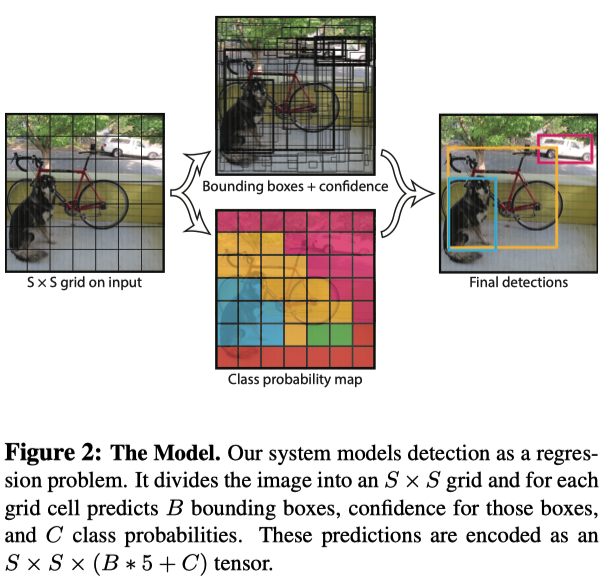
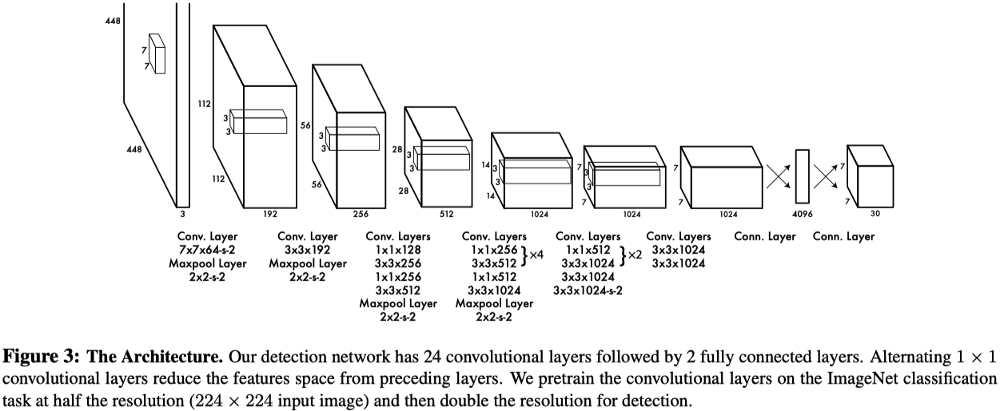

# 目标检测算法 YOLO v1
<!-- https://zhuanlan.zhihu.com/p/362758477 -->
YOLO v1 将检测问题转化为回归问题。

将一幅图像分成 $S\times S$ 个网格(grid cell)，如果某个 object 的中心落在这个网格中，则这个网格就负责预测这个 object。

每个网络需要预测B个 BBox的位置信息和 confidence（置信度）信息，一个BBox对应着四个位置信息和一个confidence信息。confidence代表了所预测的box中含有object的置信度和这个box预测的有多准两重信息：
$$
\begin{equation}
  Pr(Object)\times IOU_{pred}^{truth}
\end{equation}
$$
## YOLO v1 网络结构

## YOLO v1 损失函数

$$
\begin{equation}
  \begin{aligned}
    % 中心定位损失
    & \lambda_{\text{coord}} \sum_{i=0}^{S^{2}} \sum_{j=0}^{B} \mathbb{1}_{i j}^{\text {obj }}
    \left[\left(x_{i}-\hat{x}_{i}\right)^{2}+\left(y_{i}-\hat{y}_{i}\right)^{2}\right] \\
    % 框尺寸损失
    + & \lambda_{\text{coord}} \sum_{i=0}^{S^{2}} \sum_{j=0}^{B} \mathbb{1}_{i j}^{\text {obj }}
    \left[\left(\sqrt{w_{i}}-\sqrt{\hat{w}_{i}}\right)^{2}+\left(\sqrt{h_{i}}-\sqrt{\hat{h}_{i}}\right)^{2}\right] \\
    % 损失
    + & \sum_{i=0}^{S^{2}} \sum_{j=0}^{B} \mathbb{1}_{i j}^{\text {obj }}
    \left(C_{i}-\hat{C}_{i}\right)^{2} \\
    % 损失
    +& \lambda_{\text{noobj}} \sum_{i=0}^{S^{2}} \sum_{j=0}^{B} \mathbb{1}_{i j}^{\text {noobj }}
    \left(C_{i}-\hat{C}_{i}\right)^{2} \\
    % 损失
    + & \sum_{i=0}^{S^{2}} \mathbb{1}_{i}^{\text {obj }} \sum_{c \in \text{classes}}
    \left(p_{i}(c)-\hat{p}_{i}(c)\right)^{2}
  \end{aligned}
\end{equation}
$$

在 [yolov1 损失函数](#yolov1_loss) 中